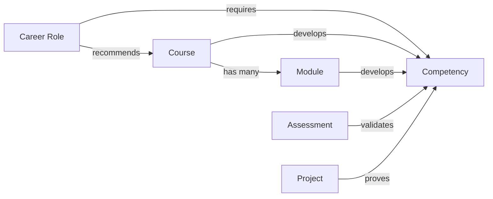
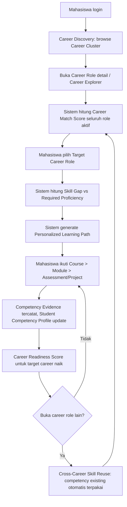
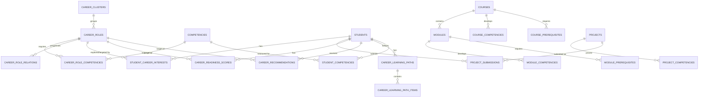

# Product Requirements Document — IS-Path

## Career-Oriented Competency-Based Learning Management System untuk Mahasiswa Sistem Informasi

**Versi Dokumen:** 2.0 (Update & Perluasan dari PRD v1.0 — *"Competency-Based LMS for IS Students"*)
**Status:** Draft untuk direview Product Owner
**Sifat perubahan:** Perluasan arsitektur & scope, **bukan penggantian konsep** — seluruh prinsip inti v1 (explainable, evidence-based, rule-based, tidak overengineered) dipertahankan.

---

## Legenda

| Penanda | Arti |
|---|---|
| *(tanpa penanda)* | **Product Requirement** |
| **[Technical Suggestion]** | Saran implementasi teknis, dapat diganti selama requirement terpenuhi |
| > 📌 **PM Note / Kritik** | Catatan kritis penyusun PRD — potensi konflik dengan v1, overengineering, atau rekomendasi perbaikan |
| > 🔄 **Reconciliation Note** | Penjelasan eksplisit bagaimana konsep baru di v2 direkonsiliasi dengan mekanisme yang sudah ada di v1 |
| > ⚠️ **Risk** | Risiko yang perlu diperhatikan |

---

## Assumptions (Update)

Asumsi tambahan khusus untuk update v2 ini (di luar assumptions v1 yang masih berlaku):

1. Nama produk final adalah **IS-Path**; nama kerja "Competency-Based LMS" pada v1 digantikan sepenuhnya.
2. Role **"Lecturer"** pada v1 di-*rename* menjadi **"Instructor"** mengikuti terminologi v2, dengan cakupan permission yang diperluas (tidak hanya membuat course, tapi juga memvalidasi competency — lihat Section 6).
3. Dari 22 Career Role yang didaftarkan, hanya ~16 yang diberi contoh **Career Learning Path Mapping** eksplisit oleh Product Owner. Untuk 6 role sisanya (mis. UI/UX Designer sudah ada implisit, tapi ERP/CRM Consultant, Cloud/DevOps Engineer sudah ada — role yang benar-benar belum: **BI Analyst sudah ada, Database Administrator, IT Auditor/GRC Analyst, IT Service Management, AI/Automation Analyst, Pre-Sales/Solution Consultant**), path & competency weight-nya diasumsikan **dibuat menyusul sebagai bagian dari Seed Data Phase (Section 34)** menggunakan pola yang sama, bukan diblokir sampai PRD berikutnya.
4. Meskipun frontend tetap mengikuti keputusan v1 (**Laravel Blade + Livewire**), requirement teknologi v2 secara eksplisit menyebut **REST API** sebagai bagian stack wajib — diasumsikan ini untuk **kebutuhan integrasi masa depan** (mobile app, SIAKAD, portal eksternal), bukan untuk menggantikan Livewire sebagai primary UI di MVP. REST API dibangun sebagai **layer tambahan di atas Application Service yang sama** (lihat Section 30), bukan arsitektur terpisah.
5. Proficiency level label **"Not Assessed"** dan **"Expert"** dari v1 dipertahankan (bukan "Not Started"/"Proficient" dari draft v2) — alasan dan detail ada di Section 20. Ini adalah keputusan PM, bukan penghapusan sepihak; didaftarkan sebagai *Decision Needed* di akhir.
6. **Career Match Score** (v1) dan **Career Readiness Score** (konsep baru v2) diperlakukan sebagai **dua metrik berbeda dengan tujuan berbeda**, bukan duplikasi — lihat rekonsiliasi di Section 13 & 21.
7. 26 course dan seluruh modulnya yang diberikan Product Owner dijadikan **baseline definitif MVP** (bukan contoh yang bisa dikurangi) — course code C01–C26 dipertahankan apa adanya sebagai identifier.

---

## Executive Summary

**IS-Path** adalah evolusi dari PRD v1 yang mereposisikan produk secara lebih tegas sebagai **"career discovery & readiness platform"**, bukan sekadar LMS dengan lapisan competency. Perbedaan paling mendasar dari v1:

- **Career Cluster & 22 Career Role terkurasi** menjadi struktur navigasi utama (bukan hanya daftar job role generik).
- **Centralized Course Catalog (26 course, ~230 module)** dengan prinsip tegas: **satu course dipakai lintas banyak career role** — tidak ada duplikasi course per career.
- **Career Readiness Score** sebagai metrik progres yang lebih granular dan longitudinal dibanding Career Match Score murni (v1), dengan progress bar per-competency.
- **Cross-Career Skill Reuse** — competency yang sudah dimiliki mahasiswa otomatis "terbawa" ke evaluasi career role lain, sebagai konsekuensi alami dari arsitektur competency yang sudah reusable sejak v1 (bukan fitur baru yang butuh tabel terpisah).
- **Ontology/Knowledge Graph dipisahkan secara eksplisit** sebagai layer konseptual dengan predikat formal (`HAS_COMPETENCY`, `REQUIRES`, `TEACHES`, dst.), tetap diimplementasikan relasional (Option A dari v1 — **tidak berubah**), namun kini didokumentasikan sebagai reasoning layer yang jelas.
- **Personalized/Adaptive Learning Path** — path tidak seragam per mahasiswa; item yang kompetensinya sudah dimiliki ditandai *"Already Competent"* dengan opsi placement test.

Seluruh keputusan arsitektur inti v1 (Laravel modular monolith, PostgreSQL, rule-based recommendation tanpa ML, mandatory competency gating, rule versioning untuk auditability, confidence score) **tetap berlaku dan menjadi fondasi v2** — dokumen ini memperluas, bukan menggantikannya.

---

## Core Domain Model



**Prinsip inti (tidak berubah dari v1, kini ditegaskan ulang sebagai prinsip domain model):** satu Competency dapat dibutuhkan oleh banyak Career Role, dan satu Course dapat mengembangkan competency yang dipakai lintas banyak Career Role — **course tidak pernah diduplikasi per career**.

**Contoh (langsung dari requirement):**

```text
Course: C03 — SQL & Relational Database
    developsCompetency → SQL

SQL dibutuhkan oleh (requiresCompetency):
    Data Analyst, Business Intelligence Analyst, Data Engineer,
    Data Scientist, Business Analyst, System Analyst,
    Database Administrator, Software Developer
```

Satu baris di `courses`, satu baris di `competencies`, delapan baris relasi di `career_role_competencies` — **tidak ada duplikasi entity apa pun**. Ini adalah aturan arsitektur yang mengikat seluruh desain database di Section 27.

---

# 1. Product Vision (Updated)

> "Menjadi peta jalan karier yang hidup bagi setiap mahasiswa Sistem Informasi — dari 'saya belum tahu mau ke mana', menjadi 'saya tahu persis career role apa yang cocok, kompetensi apa yang harus saya bangun, dan seberapa siap saya hari ini' — dibuktikan lewat course, module, assessment, dan project yang benar-benar relevan, bukan kurikulum generik yang sama untuk semua orang."

> 📌 **PM Note:** Visi v1 lebih menekankan "kombinasi LMS+Competency+Career+Ontology System". Visi v2 mempertajam framing menjadi **career-first**: LMS bukan lagi disebutkan sebagai kapabilitas sejajar, melainkan **sarana** untuk mencapai career readiness. Ini konsisten dengan penegasan eksplisit "jangan diposisikan sebagai LMS biasa" pada requirement baru.

---

# 2. Product Goals (Updated)

| # | Goal | Status vs v1 |
|---|---|---|
| G1 | Mahasiswa dapat melakukan **Career Discovery** terstruktur lewat 8 Career Cluster dan 22 Career Role terkurasi | **Baru** |
| G2 | Course dan module bersifat **reusable lintas career role**, tidak ada duplikasi konten | **Baru (ditegaskan sebagai prinsip arsitektur wajib)** |
| G3 | Mahasiswa mendapat **Career Readiness Score** granular per competency, bukan hanya skor tunggal | **Diperluas dari v1** |
| G4 | Competency yang sudah dimiliki otomatis terpakai ulang lintas career role (**Cross-Career Skill Reuse**) | **Baru** |
| G5 | Learning Path bersifat **personalized/adaptive** — bukan urutan seragam untuk semua mahasiswa | **Diperluas dari v1** |
| G6 | Seluruh keputusan rekomendasi tetap **rule-based, explainable, auditable** | **Dipertahankan dari v1** |
| G7 | Ontology didokumentasikan sebagai **layer reasoning eksplisit**, terpisah dari layer relational | **Diperjelas dari v1** |
| G8 | Sistem menyediakan **REST API** sebagai layer integrasi masa depan | **Baru** |

---

# 3. Product Scope

## In-Scope (MVP + Roadmap dekat)

Career Discovery, Career Explorer, Career Matching, Skill Gap Analysis, Personalized Learning Path, Course & Module Management (26 course baseline), Assessment multi-level, Project-Based Learning, Competency Management, Career Readiness Score, Ontology layer (relational), Rule-Based Recommendation Engine, REST API, Admin/Student/Instructor Dashboard.

## Non-Goals (Dipertahankan dari v1, ditegaskan ulang)

- **Bukan job board / platform rekrutmen** — "Job Vacancy Integration" eksplisit masuk P2/Future (Section 37), bukan MVP.
- **Bukan platform dengan Machine Learning Recommendation** di MVP — tetap rule-based (ditegaskan ulang di requirement baru Section 26).
- **Bukan pengganti SIAKAD** kampus.
- **Bukan marketplace / payment / instructor payout.**
- **Bukan Semantic Web Ontology formal (RDF/OWL/SPARQL)** sebagai infrastruktur produksi — tetap direkomendasikan Option A relasional (lihat Section 22).

---

# 4. Target Users

Tidak berubah secara fundamental dari v1: **Student** (primary), **Instructor** (secondary, di-*rename* dari Lecturer), **Admin**. Role **Curriculum/Competency Committee** dari v1 **tetap dipertahankan** sebagai permission group (lihat Section 6) karena relevansinya justru meningkat di v2 — semakin banyak career role & competency weight yang perlu divalidasi pakar domain.

---

# 5. User Personas

## 5.1 Student — Rani (dipertahankan dari v1, diperluas)

Rani kini punya kebutuhan tambahan v2: ia ingin **membandingkan 2–3 career role sekaligus** sebelum memutuskan (Section 12), dan ingin tahu bila kompetensi yang ia bangun untuk satu career (mis. Data Analyst) **juga berlaku** untuk career lain (mis. Business Analyst) — sehingga ia tidak merasa "mulai dari nol" setiap kali eksplorasi career baru.

## 5.2 Instructor — Pak Budi (rename dari Lecturer, scope diperluas)

Selain mengelola course/module/assessment miliknya, Pak Budi kini juga berperan **memvalidasi competency** yang diklaim mahasiswa lewat project submission — peran yang lebih eksplisit dibanding v1 ("Instructor Can: ... Validate competencies").

## 5.3 Administrator — Sarah (dipertahankan, scope database jauh lebih besar)

Sarah kini mengelola: Career Cluster, 22 Career Role, 26 Course + ~230 Module, Career-Competency weight per role, Course/Module Prerequisite graph, Ontology Relations — volume data master jauh lebih besar dibanding v1, sehingga **bulk seed data & admin bulk-edit tooling menjadi jauh lebih penting** (lihat Section 34).

## 5.4 Curriculum/Competency Committee (dipertahankan dari v1)

Relevansi meningkat: komite ini yang idealnya menyetujui **competency weight per career role** (Section 13) dan **career learning path** (Section 15) sebelum publish, karena keduanya adalah keputusan domain akademik/industri, bukan keputusan teknis.

---

# 6. User Roles & Permission Matrix (Updated)

| Kapabilitas | Student | Instructor | Admin | Curriculum Committee* |
|---|:---:|:---:|:---:|:---:|
| Explore career, pilih target career, ikuti assessment/project | ✅ | – | – | – |
| Kelola course/module yang diampu, buat assessment | – | ✅ | ✅ (semua) | – |
| Review assignment & project, **validasi competency claim** | – | ✅ | ✅ | – |
| CRUD Career Cluster, Career Role, Competency | – | – | ✅ | ✅ (approve) |
| CRUD Course, Module, Prerequisite | – | – | ✅ | – |
| CRUD Career-Course-Competency Mapping | – | – | ✅ | ✅ (approve) |
| CRUD Ontology Relations | – | – | ✅ | ✅ (approve) |
| Atur Career Weight & Proficiency Requirement | – | – | ✅ | ✅ (approve) |
| Manage Users & Permission | – | – | ✅ | – |
| Lihat Career Readiness & Competency Profile mahasiswa | ✅ (sendiri) | ✅ (kelasnya) | ✅ (semua) | ✅ (agregat) |

*\*Sama seperti v1: operasional MVP dijalankan lewat akun Admin, permission group tetap terpisah secara sistem.*

---

# 7. User Journey (Updated)



**Perbedaan kunci vs v1:** loop v1 berpusat pada "assessment → competency → recommendation → gap → learning path" secara generik. Loop v2 secara eksplisit dimulai dari **Career Discovery** (browsing cluster/role) sebagai entry point utama, dan menutup loop dengan **Cross-Career Skill Reuse** yang membuat eksplorasi career kedua/ketiga terasa jauh lebih cepat (kompetensi tidak dihitung ulang dari nol).

---

# 8. Functional Requirements (Consolidated Overview)

*(Master list — detail algoritma & UI tiap fitur ada di Section 11–26 sesuai penomoran yang diminta.)*

| Modul | Requirement Ringkas | Detail di Section |
|---|---|---|
| Career Discovery | Browse Career Cluster & Career Role, filter, search | 11 |
| Career Explorer | Career card, match %, readiness %, comparison | 12 |
| Career Matching | Hitung Match Score seluruh role aktif | 13 |
| Skill Gap Analysis | Bandingkan current vs required proficiency per competency | 14 |
| Learning Path | Generate path dari gap, adaptif, cross-career aware | 15 |
| Course Management | CRUD 26 course baseline, prerequisite, competency mapping | 16 |
| Module Management | CRUD module dalam course, module prerequisite | 17 |
| Assessment | Multi-level assessment (module/course/competency/career) | 18 |
| Project-Based Learning | Project sebagai proof of competency, portfolio | 19 |
| Competency Management | Taxonomy, proficiency level, student competency profile | 20 |
| Career Readiness | Skor progres per target career, progress bar per competency | 21 |
| Ontology | Predicate formal, reasoning rule, layer terpisah dari relational | 22 |
| Recommendation Engine | Rule-based IF-THEN, prerequisite-aware | 23 |
| Admin Dashboard | Ringkasan sistem & data master | 24 |
| Student Dashboard | Learning Dashboard personal | 25 |
| Instructor Dashboard | Ringkasan course & validasi competency | 26 |

---

# 9. Non-Functional Requirements (Carried Over + Additions)

Seluruh NFR v1 (Security, Performance, Scalability, Reliability, Logging, Auditability — lihat PRD v1 Section 25–30) **tetap berlaku tanpa perubahan besar**. Penambahan khusus v2:

| Area | Requirement Baru |
|---|---|
| Data Integrity | Sistem **wajib mencegah duplikasi course/module** untuk career role yang berbeda — validasi di level aplikasi saat admin membuat course baru (cek kemiripan judul/slug, warning jika ada course serupa) |
| Query Performance | Query "career role mana saja yang membutuhkan competency X" dan "course mana saja yang mengembangkan competency X" harus di bawah 200ms pada skala 26 course × 230 module × 22 role — dicapai lewat indexing pada pivot table (Section 27) |
| API Availability | REST API (Section 30) mengikuti SLA yang sama dengan aplikasi utama karena berbagi Application Service layer yang sama (bukan sistem terpisah yang bisa "down" independen) |

---

# 10. Feature Requirements (Feature Map)

*(Peta fitur menyeluruh — berfungsi sebagai daftar isi fitur sebelum masuk ke detail Section 11–26. Tidak mengulang isi Section 8, melainkan mengelompokkan fitur menjadi tiga tingkat kematangan.)*

| Tingkat | Fitur |
|---|---|
| **Foundational** (harus ada sebelum fitur lain berjalan) | Competency taxonomy, Course catalog, Career role & cluster, Ontology relations dasar |
| **Core Loop** (value proposition inti) | Career Discovery → Career Matching → Skill Gap → Learning Path → Assessment/Project → Competency Profile → Career Readiness |
| **Supporting** (memperkuat core loop) | Career Comparison, Cross-Career Skill Reuse, Personalized/Adaptive Path, Instructor Validation, Dashboards, REST API

# 11. Career Discovery

## 11.1 Career Cluster & Career Role

Career Discovery adalah **entry point utama** produk (bukan course catalog) — mahasiswa mulai dari cluster, bukan dari daftar course.

| Cluster | Career Role | Level |
|---|---|---|
| **Data & Analytics** | Data Analyst | Standard |
| | Business Intelligence Analyst | Standard |
| | Data Engineer | Standard |
| | Data Scientist | **Advanced Career Path** |
| | Database Administrator | Standard |
| **Business & Information Systems** | Business Analyst | Standard |
| | System Analyst | Standard |
| | Product Manager / Product Owner | Standard |
| | ERP / CRM Consultant | Standard |
| | IT / Digital Consultant | Standard |
| **Software & Product Development** | Software / Web Developer | Standard |
| | QA Engineer / Software Tester | Standard |
| | UI/UX Designer | Standard |
| **Infrastructure & Cloud** | System / Network Administrator | Standard |
| | Cloud / DevOps Engineer | Standard |
| **Cybersecurity & Governance** | Cybersecurity Analyst | Standard |
| | IT Auditor / GRC Analyst | Standard |
| **IT Management** | IT Project Manager / Scrum Master | **Advanced Career Path** |
| | IT Service Management / IT Support | Standard |
| **Architecture** | Solution Architect | **Advanced Career Path** |
| **Emerging Technology** | AI / Automation Analyst | Standard |
| **Consulting** | Pre-Sales / Solution Consultant | Standard |

> 📌 **PM Note:** Label **"Advanced Career Path"** diimplementasikan sebagai atribut `career_level` (ENUM: `standard`, `advanced`) pada tabel `career_roles`, **bukan** tabel/relasi terpisah — cukup flag sederhana yang memengaruhi tampilan badge di UI dan (opsional) memberi peringatan "role ini umumnya membutuhkan pengalaman/kompetensi lanjutan" di halaman detail. Menghindari overengineering berupa sistem "career tier" yang kompleks.

## 11.2 Fungsional

- FR-DISC-01: Mahasiswa dapat browse Career Role dikelompokkan per Career Cluster.
- FR-DISC-02: Mahasiswa dapat filter berdasarkan cluster, career level (standard/advanced), dan status (belum dieksplorasi/sudah dieksplorasi/target career terpilih).
- FR-DISC-03: Setiap Career Role menampilkan preview singkat (nama, cluster, 3–4 top required competency, Career Match Score jika mahasiswa sudah login).

---

# 12. Career Explorer

## 12.1 Career Role Detail Page — Komponen Wajib

Sesuai requirement, minimal menampilkan:

| Komponen | Sumber Data |
|---|---|
| Career Role Name, Cluster, Description | `career_roles` |
| Difficulty / Career Level | `career_roles.career_level` |
| Required Competencies (+ minimum level + weight) | `career_role_competencies` |
| Recommended Courses | Diturunkan dari `career_role_competencies` × `course_competencies` |
| Estimated Learning Progress | Agregat `student_course_progress` untuk course yang relevan |
| Student Career Match % | Hasil `CalculateCareerMatch` (Section 13) |
| Career Readiness % | Hasil `CalculateCareerReadiness` (Section 21) |
| Skill Gap | Hasil `CalculateSkillGap` (Section 14) |
| Career Roadmap | `career_role_relations` (progression, related — pola sama seperti v1) |

## 12.2 Career Card (Ringkas, untuk listing)

```text
Data Analyst
Career Match: 82%
Readiness: 63%

Top Skills:
SQL · Excel · Power BI · Python

[View Career Path]
```

> 🔄 **Reconciliation Note:** Career Card menampilkan **dua angka berbeda** (Match 82% vs Readiness 63%) secara sengaja, bukan redundansi — lihat penjelasan lengkap rekonsiliasi dua metrik ini di Section 13.4.

## 12.3 Career Comparison

Fitur membandingkan 2 (atau 3, **[Should Have]**) career role sekaligus.

**Algoritma:**

```text
INPUT: career_role_id_A, career_role_id_B
1. Ambil requirement competency masing-masing role
2. Shared Competencies = irisan competency yang dibutuhkan kedua role
3. Unique Competencies (A) = competency yang hanya dibutuhkan role A
4. Unique Competencies (B) = competency yang hanya dibutuhkan role B
5. Transferability % = (jumlah Shared Competency yang SUDAH dimiliki mahasiswa
                         di level memadai) / (total Shared Competency) × 100
6. OUTPUT: breakdown Shared / Unique A / Unique B + Transferability %
```

**Contoh Output:**

```text
Data Analyst vs Business Analyst

Shared Competencies: SQL, Business Understanding, Data Interpretation
Data Analyst Unique: Python, Power BI, Statistics
Business Analyst Unique: BPMN, Requirement Analysis, Stakeholder Analysis

"62% dari kompetensi yang kamu miliki dapat langsung dipakai
 untuk Business Analyst."
```

> 📌 **PM Note:** Fitur ini **tidak memerlukan tabel baru** — seluruhnya query terhadap `career_role_competencies` dan `student_competencies` yang sudah ada. Ini murni fitur presentasi/UI di atas data yang sudah ada, konsisten dengan prinsip "hindari over-engineered architecture".

# 13. Career Matching

## 13.1 Career Weight per Career Role

Setiap Career Role memiliki competency requirement dengan **weight** (persentase kontribusi terhadap Match Score) dan **required proficiency level** (0–5).

**Contoh (representatif — pola yang sama diterapkan ke seluruh 22 role via seed data, lihat Section 34):**

| Career Role | Competency | Weight | Required Level |
|---|---|---|---|
| **Data Analyst** | SQL | 25% | 4 |
| | Power BI | 25% | 4 |
| | Excel | 15% | 4 |
| | Statistics | 15% | 3 |
| | Python | 15% | 3 |
| | Business Understanding | 5% | 2 |
| **Business Analyst** | Requirement Analysis | 25% | 4 |
| | Stakeholder Management | 20% | 4 |
| | Business Process Analysis | 20% | 4 |
| | SQL | 15% | 2 |
| | Communication | 15% | 4 |
| | Systems Analysis | 5% | 2 |
| **System Analyst** | Requirement Analysis | 20% | 4 |
| | Systems Analysis & Design | 25% | 4 |
| | Database Design | 20% | 3 |
| | Business Process Analysis | 15% | 3 |
| | Software Architecture (basic) | 10% | 2 |
| | Communication | 10% | 3 |
| **Software Developer** | Programming / OOP | 30% | 4 |
| | Web Development & REST API | 25% | 4 |
| | Database Design | 15% | 3 |
| | Git & Version Control | 10% | 3 |
| | Software Testing (basic) | 10% | 2 |
| | Problem Solving | 10% | 3 |
| **Data Scientist** *(Advanced)* | Statistics | 25% | 4 |
| | Python | 25% | 4 |
| | Machine Learning | 25% | 4 |
| | SQL | 15% | 3 |
| | Data Visualization | 10% | 3 |

> 📌 **PM Note:** Bobot di atas adalah **starting configuration**, sama seperti v1 — perlu dikalibrasi bersama pakar/instruktur (lihat PRD v1 Section 40, Recommendation Validation Strategy, yang **tetap berlaku penuh untuk v2** tanpa perubahan metodologi).

## 13.2 Formula Match Score (Tidak Berubah dari v1, Konsisten Digunakan)

```text
MatchScore(Student, CareerRole) =
    Σ ( StudentCompetencyScore_i × CareerRoleWeight_i )
    ──────────────────────────────────────────────────
              Σ ( CareerRoleWeight_i )
```

**Mandatory gating** (`is_required = true`) tetap berlaku persis seperti v1 Section 15.3: jika ada competency mandatory di bawah `required_level` yang setara skornya, kategori dipaksa menjadi **"Not Ready"** — lihat Section 21 untuk bagaimana ini berinteraksi dengan Career Readiness Score.

## 13.3 Output & Explanation

```text
Data Analyst — Match Score: 78%

Strengths:
- SQL (85)
- Excel (80)

Skill Gaps:
- Python (45, required setara level 3)
- Statistics (52, required setara level 3)

Recommended next learning:
- Python for Data Analytics (C06)
- Statistics for Analytics (C05)
```

## 13.4 🔄 Reconciliation: Career Match Score vs Career Readiness Score

> Ini adalah titik krusial yang harus diperjelas karena requirement v2 memperkenalkan **dua konsep skor** yang tampak mirip tapi punya tujuan berbeda:

| | **Career Match Score** (v1, dipertahankan) | **Career Readiness Score** (baru, Section 21) |
|---|---|---|
| **Tujuan** | Discovery — mengurutkan/membandingkan **banyak career role sekaligus** dengan cepat | Commitment tracking — progres mendalam terhadap **satu target career yang dipilih** |
| **Basis perhitungan** | `CompetencyScore` (0–100, kontinu, dari evidence) | `ProficiencyLevel` (0–5, diskret) dibandingkan `RequiredLevel`, dengan cap 100% per competency |
| **Konteks tampil** | Career Explorer listing, Career Card | Learning Dashboard, halaman Target Career |
| **Frekuensi update** | Dihitung untuk **semua** role setiap kali profil berubah (background job) | Dihitung untuk **target career terpilih saja**, real-time saat dibuka |
| **Format tampilan** | Persentase tunggal + breakdown strong/gap | Persentase + **progress bar per competency** (lihat Section 21) |

**Kenapa dua metrik, bukan satu?** Menampilkan 22 progress bar granular untuk setiap career role di halaman listing akan membebani mahasiswa secara kognitif (terlalu banyak informasi untuk tahap "masih menjelajah"). Match Score memberi sinyal cepat untuk **penyaringan awal**; Readiness Score memberi kedalaman untuk **role yang sudah dipilih serius**. Keduanya memakai sumber data yang sama (`student_competencies`), hanya cara agregasi dan level of detail yang berbeda — **tidak ada duplikasi data**, hanya dua cara membaca data yang sama.

---

# 14. Skill Gap Analysis

## 14.1 Algoritma (Level-Based, Selaras dengan Career Readiness)

```text
INPUT: student_id, target_career_role_id
1. Ambil seluruh career_role_competencies untuk target_career_role_id
2. Untuk setiap requirement:
     a. StudentLevel = proficiency_level mahasiswa saat ini (0 jika belum ada evidence)
     b. RequiredLevel = required_level dari requirement
     c. Delta = RequiredLevel - StudentLevel
     d. Status:
          - Delta <= 0            → "Ready"
          - Delta == 1             → "Skill Gap"
          - Delta >= 2             → "Major Skill Gap"
3. Urutkan: Major Skill Gap dahulu (terutama yang is_required=true),
   lalu Skill Gap, lalu Ready
4. OUTPUT: daftar competency + current/required level + status
```

## 14.2 Contoh Output

```text
SQL
Student: 4/5   Required: 4/5   Status: Ready

Python
Student: 2/5   Required: 3/5   Status: Skill Gap

Power BI
Student: 1/5   Required: 4/5   Status: Major Skill Gap
```

> 🔄 **Reconciliation Note:** Status "Ready / Skill Gap / Major Skill Gap" (level-based, v2) setara secara konsep dengan severity "Minor/Moderate/Critical" pada v1 (yang berbasis skor 0–100). Untuk konsistensi lintas dokumen, **v2 mengadopsi label level-based ini sebagai standar**, karena lebih mudah dipahami mahasiswa (perbandingan 4/5 vs 2/5 lebih intuitif dibanding selisih skor 82 vs 45). `is_required=true` pada competency dengan status Major Skill Gap tetap memicu **Blocking Gap** pada Match Score (Section 13.2), sama seperti v1.

## 14.3 Rekomendasi Course Otomatis dari Gap

Untuk setiap competency dengan status Skill Gap/Major Skill Gap, sistem mencari Course yang mengembangkan competency tersebut (`course_competencies`), diurutkan berdasarkan prerequisite (Section 16.4) — algoritma ini **identik dengan v1 Section 17**, tidak berubah.

# 15. Learning Path

## 15.1 Career Learning Path Mapping (Baseline)

Urutan course per career role, sebagai baseline MVP (course code merujuk Section 16):

| Career Role | Course Sequence |
|---|---|
| **Data Analyst** | C04 Excel → C03 SQL → C05 Statistics → C06 Python → C07 Power BI → Portfolio Project |
| **Business Intelligence Analyst** | C04 Excel → C03 SQL → C02 Business Process → Data Modeling (dalam C08) → C07 Power BI → BI Dashboard Project |
| **Data Engineer** | C03 SQL → C06 Python → Database (dalam C03) → C08 Data Engineering → Cloud (dalam C19) → Data Pipeline Project |
| **Data Scientist** | C03 SQL → C05 Statistics → C06 Python → EDA (dalam C06) → C09 Machine Learning → ML Project |
| **Business Analyst** | C01 IS Fundamentals → C02 Business Process → C03 SQL (fundamentals) → C10 Business Analysis → C11 Systems Analysis → C13 Agile → BA Case Study |
| **System Analyst** | C01 IS Fundamentals → C02 Business Process → Database (dalam C03) → C10 Business Analysis → C11 Systems Analysis & Design → Architecture Fundamentals (dalam C24) → System Design Project |
| **Product Manager** | C01 IS Fundamentals → C10 Business Analysis → UI/UX Fundamentals (dalam C17) → C12 Product Management → C13 Agile → Product Case Study |
| **Software Developer** | C14 Programming & OOP → Git (dalam C14) → Database (dalam C03) → C15 Web Development & REST API → Deployment (dalam C19) → Software Project |
| **QA Engineer** | SDLC (dalam C11) → C11 Systems Analysis → C16 Software QA → Test Case (dalam C16) → API Testing (dalam C16) → Automation Testing (dalam C16) → QA Project |
| **UI/UX Designer** | C17 HCI → UX Research (dalam C17) → User Persona (dalam C17) → Wireframe (dalam C17) → Figma (dalam C17) → Prototype (dalam C17) → Usability Testing (dalam C17) → Portfolio |
| **Cloud/DevOps Engineer** | Linux (dalam C18) → C18 Networking → C19 Cloud → Docker (dalam C19) → CI/CD (dalam C19) → Monitoring (dalam C19) → C19 Cloud Security → Deployment Project |
| **Cybersecurity Analyst** | C18 Networking → Linux (dalam C18) → C20 Security Fundamentals → Vulnerability Management (dalam C20) → SIEM (dalam C20) → Incident Response (dalam C20) → Cybersecurity Project |
| **IT Project Manager** | C01 IS Fundamentals → C11 System Analysis → C13 Project Management → Agile/Scrum (dalam C13) → Risk Management (dalam C13) → Project Simulation (dalam C13) |
| **ERP Consultant** | C01 IS Fundamentals → C02 Business Process → Database Fundamentals (dalam C03) → C10 Business Analysis → C22 ERP Fundamentals → ERP Implementation (dalam C22) |
| **Solution Architect** *(Advanced)* | C11 System Analysis → Database (dalam C03) → C15 Web & API → C18 Infrastructure → C19 Cloud → C20 Security → C24 Solution Architecture |

> 📌 **PM Note — Assumption #3:** Product Owner memberi contoh path eksplisit untuk 15 dari 22 role. **7 role sisanya** (Database Administrator, ERP/CRM Consultant *sudah tercakup di atas sebagai "ERP Consultant"*, IT/Digital Consultant, System/Network Administrator, IT Auditor/GRC Analyst, IT Service Management/Support, AI/Automation Analyst, Pre-Sales/Solution Consultant) **belum memiliki path eksplisit** dari requirement. Ini didaftarkan sebagai tugas Seed Data (Section 34) menggunakan course yang sudah ada (mis. Database Administrator dapat disusun dari C03 SQL (advanced) → Indexing/Optimization (dalam C03) → C18 Infrastructure, tanpa perlu course baru) — **bukan blocker MVP**, tapi perlu dikonfirmasi Curriculum Committee sebelum go-live untuk role-role tersebut.

## 15.2 Generate Learning Path — Algoritma (Sama dengan v1, + Cross-Career Awareness)

```text
INPUT: student_id, target_career_role_id
1. Jalankan Skill Gap Analysis (Section 14)
2. Untuk setiap competency dengan status Skill Gap/Major Skill Gap:
     a. Cari Course/Module yang mengembangkan competency tsb
     b. Filter yang belum diselesaikan mahasiswa
3. Untuk setiap competency dengan status "Ready":
     a. Tandai course/module terkait sebagai "Already Competent"
        (lihat 15.3 — bukan dihapus dari path, tapi ditandai skip-able)
4. Urutkan hasil berdasarkan prerequisite (course & module level, Section 16.4/17.3)
5. Simpan sebagai career_learning_path + career_learning_path_items,
   status per item: pending | already_competent | in_progress | completed
```

## 15.3 Personalized / Adaptive Learning Path

Path **tidak seragam** antar mahasiswa — konsekuensi langsung dari Skill Gap Analysis per individu.

```text
Contoh: Student sudah menguasai SQL Level 4

Ketika memilih path Data Analyst:

Excel                          → pending
SQL                            → already_competent ✓ (opsi: Placement Test / Skip)
Statistics                     → pending
Python                         → pending
Power BI                       → pending
```

**Placement Test:** untuk item berstatus `already_competent`, mahasiswa dapat memilih:
- **Skip** — item ditandai `completed_via_placement`, tidak menghasilkan evidence baru, tapi tidak memblokir progress.
- **Ambil Placement Test** — assessment singkat (level Competency, lihat Section 18) untuk **memvalidasi ulang** level yang diklaim; jika lulus, evidence baru tercatat (menaikkan Confidence Score); jika gagal, item dikembalikan ke status `pending` dengan gap yang diperbarui.

> 📌 **PM Note:** Placement Test **bukan tabel/entity baru** — ini adalah `assessment` biasa dengan atribut `assessment_purpose = 'placement_test'`, memakai infrastruktur Assessment yang sama persis (Section 18). Menghindari duplikasi sistem.

## 15.4 Cross-Career Skill Reuse

> 🔄 **Reconciliation Note — ini bukan fitur baru secara arsitektur, melainkan konsekuensi dari desain yang sudah benar sejak v1.**

Karena `student_competencies` adalah **satu profil global per mahasiswa** (bukan per career role), maka ketika mahasiswa membuka career role kedua, seluruh competency yang relevan **otomatis ikut terhitung** — tidak perlu proses "transfer" eksplisit apa pun.

```text
Student mengikuti Data Analyst path, mencapai:
  SQL — Level 4

Student membuka Business Analyst (SQL dibutuhkan di level 2):

  ✓ "Kamu sudah memenuhi requirement SQL untuk Business Analyst
     (Level 4/2). Career readiness Business Analyst naik otomatis."
```

**Yang perlu dibangun hanyalah lapisan presentasi:**
- FR-REUSE-01: Saat membuka Career Role baru, sistem menampilkan badge **"Sudah Terpenuhi dari career lain"** pada competency requirement yang sudah dipenuhi mahasiswa.
- FR-REUSE-02: Career Readiness Score career role manapun **selalu dihitung ulang otomatis** setiap `student_competencies` berubah (event `CompetencyEvidenceRecorded`, sama seperti v1) — tanpa mahasiswa perlu memicu manual.

> 📌 **PM Note:** Requirement awal menyebut ini sebagai "fitur penting" dan meminta desain khusus. Kritik saya: **memperlakukannya sebagai sistem terpisah justru berisiko overengineering** (mis. membuat tabel `skill_transfer_log`). Desain yang benar adalah memastikan arsitektur competency **tetap satu sumber kebenaran global** (sudah demikian sejak v1) — "cross-career reuse" lalu otomatis terjadi tanpa kode tambahan di luar UI badge di atas.

# 16. Course Management

## 16.1 Prinsip Wajib: Centralized, Reusable Course Catalog

- FR-CRS-01: Course adalah entity **global**, tidak pernah dibuat ulang per career role — direlasikan lewat `course_competencies` dan `career_role_competencies` (lihat Section 27).
- FR-CRS-02: Sistem **mencegah pembuatan course duplikat** — validasi kemiripan slug/judul saat admin membuat course baru (NFR Section 9).
- FR-CRS-03: Course memiliki status Draft → Review → Published → Archived (sama seperti v1).
- FR-CRS-04: Course dapat memiliki Course Prerequisite (Section 16.4).

## 16.2 Course Catalog Baseline (26 Course)

*(Modul disalin dari baseline Product Owner sebagai definitive MVP content — lihat Assumption #7. Kolom "Kompetensi Utama" ditambahkan sebagai hasil analisis untuk keperluan `course_competencies` mapping.)*

### C01 — Information Systems Fundamentals
**Kompetensi utama:** Business Understanding, IS Concepts
1. Introduction to Information Systems
2. People, Process, Data & Technology
3. Information Systems in Organizations
4. Business Models & Value Chains
5. Enterprise Information Systems
6. Digital Transformation & IS Ethics

### C02 — Business Process & BPMN
**Kompetensi utama:** Business Process Analysis, BPMN
1. Introduction to Business Process
2. Identifying Business Processes
3. AS-IS Process Analysis
4. BPMN Events & Activities
5. Gateway, Pool & Lane
6. TO-BE Process Design
7. Process KPI & Bottleneck Analysis
8. Business Process Improvement Project

### C03 — SQL & Relational Database
**Kompetensi utama:** SQL, Database Design *(Modul 1–4 Beginner, 5–7 Intermediate, 8–10 Advanced)*
1. Introduction to Database & RDBMS
2. SELECT, WHERE, ORDER BY
3. Aggregate Functions & GROUP BY
4. SQL JOIN
5. Subquery & Common Table Expression
6. INSERT, UPDATE & DELETE
7. Database Design & Normalization
8. Window Functions
9. Indexing & Query Optimization
10. SQL Data Analysis Case Study

### C04 — Excel for Data Analytics
**Kompetensi utama:** Excel
1. Excel Fundamentals
2. Data Cleaning
3. Logical & Statistical Functions
4. XLOOKUP / INDEX MATCH
5. Pivot Table
6. Data Visualization
7. Power Query
8. Interactive Excel Dashboard Project

### C05 — Statistics for Analytics
**Kompetensi utama:** Statistics
1. Descriptive Statistics
2. Data Distribution
3. Probability Fundamentals
4. Sampling
5. Confidence Interval
6. Hypothesis Testing
7. Correlation
8. Linear Regression

### C06 — Python for Data Analytics
**Kompetensi utama:** Python, Data Analysis, Data Visualization
1. Python Environment & Syntax
2. Variables & Data Types
3. Lists, Dictionaries & Tuples
4. Conditions, Loops & Functions
5. NumPy Fundamentals
6. Pandas Fundamentals
7. Data Cleaning
8. Exploratory Data Analysis
9. Data Visualization
10. Data Analytics Project

### C07 — Power BI
**Kompetensi utama:** Power BI, Data Visualization
1. Introduction to Business Intelligence
2. Power BI Ecosystem
3. Connecting Data Sources
4. Power Query
5. Data Transformation
6. Data Modeling & Relationships
7. DAX Fundamentals
8. Data Visualization
9. Dashboard Design
10. End-to-End BI Dashboard Project

### C08 — Data Engineering Fundamentals
**Kompetensi utama:** Data Modeling, Data Engineering
1. Introduction to Data Engineering
2. Advanced SQL
3. Data Modeling
4. ETL vs ELT
5. Python Data Pipeline
6. Working with APIs
7. Data Warehouse
8. Data Lake
9. Data Pipeline Orchestration
10. Data Engineering Project

### C09 — Machine Learning
**Kompetensi utama:** Machine Learning
1. Introduction to Machine Learning
2. Machine Learning Workflow
3. Data Preprocessing
4. Linear Regression
5. Classification
6. Decision Tree & Ensemble
7. Clustering
8. Model Evaluation
9. Feature Engineering & Explainability
10. Machine Learning Project

### C10 — Business Analysis
**Kompetensi utama:** Requirement Analysis, Business Analysis
1. Introduction to Business Analysis
2. Stakeholder Analysis
3. Requirement Elicitation
4. Functional & Non-Functional Requirements
5. User Stories
6. Use Cases
7. Acceptance Criteria
8. Gap Analysis & Root Cause Analysis
9. Requirement Prioritization
10. Business Analysis Case Study

### C11 — Systems Analysis & Design
**Kompetensi utama:** Systems Analysis & Design, Software Architecture (basic)
1. System Development Life Cycle
2. Feasibility Study
3. Requirement Analysis
4. Use Case Diagram
5. Activity Diagram
6. Sequence Diagram
7. Class Diagram
8. Entity Relationship Diagram
9. System Architecture Fundamentals
10. System Design Project

### C12 — Product Management
**Kompetensi utama:** Product Management
1. Product Management Fundamentals
2. Product Discovery
3. Customer Problem Identification
4. Value Proposition
5. Product Requirement Document
6. Product Roadmap
7. Prioritization Framework
8. Product Metrics & Experimentation

### C13 — Project Management & Agile
**Kompetensi utama:** Project Management, Agile
1. Project Management Fundamentals
2. Project Scope & WBS
3. Scheduling
4. Resource & Cost Management
5. Risk Management
6. Agile Fundamentals
7. Scrum & Kanban
8. Agile Project Simulation

### C14 — Programming & Object-Oriented Programming
**Kompetensi utama:** Programming, OOP
1. Programming Logic
2. Variables & Data Types
3. Conditional Statements
4. Loops
5. Functions
6. Data Structures
7. Object-Oriented Programming
8. Error Handling
9. Git & Version Control
10. Programming Project

### C15 — Web Development & REST API
**Kompetensi utama:** Web Development, API Development *(Optional specialization: PHP → Laravel → REST API → PostgreSQL)*
1. How The Web Works
2. HTML
3. CSS
4. JavaScript Fundamentals
5. HTTP & Client-Server Architecture
6. Backend & MVC
7. REST API
8. Authentication & Authorization
9. Database Integration
10. Fullstack Application Project

### C16 — Software Quality Assurance
**Kompetensi utama:** Software Testing
1. Software Quality Fundamentals
2. Software Testing Lifecycle
3. Test Scenario & Test Case
4. Bug Reporting
5. API Testing with Postman
6. Automation Testing Fundamentals
7. Performance & Security Testing Introduction
8. QA Testing Project

### C17 — UI/UX Design
**Kompetensi utama:** UI Design, UX Research
1. Human Centered Design
2. UX Research
3. User Persona
4. Customer Journey
5. Information Architecture
6. Wireframing
7. UI Design with Figma
8. Prototype
9. Usability Testing & Accessibility
10. UI/UX Portfolio Case Study

### C18 — IT Infrastructure & Networking
**Kompetensi utama:** Networking, Linux
1. Computer Hardware & Operating Systems
2. Network Fundamentals
3. TCP/IP
4. IP Addressing & Subnetting
5. Switching & Routing
6. DNS & DHCP
7. Linux Fundamentals
8. Virtualization
9. Monitoring & Troubleshooting
10. Infrastructure Lab Project

### C19 — Cloud & DevOps
**Kompetensi utama:** Cloud Computing *(Optional specialization: AWS / Azure / GCP)*
1. Cloud Computing Fundamentals
2. Cloud Networking
3. Identity & Access Management
4. Compute & Storage
5. Docker
6. CI/CD
7. Infrastructure as Code
8. Monitoring & Logging
9. Cloud Security
10. Cloud Deployment Project

### C20 — Cybersecurity
**Kompetensi utama:** Cybersecurity
1. Cybersecurity Fundamentals
2. CIA Triad & Security Risk
3. Network Security
4. Identity & Access Management
5. Endpoint Security
6. Web Application Security
7. Vulnerability Management
8. Logging & SIEM
9. Incident Response
10. Cybersecurity Investigation Project

### C21 — IT Governance, Risk & Audit
**Kompetensi utama:** IT Governance
1. IT Governance Fundamentals
2. IT Risk Management
3. IT Controls
4. COBIT Fundamentals
5. ISO 27001 Fundamentals
6. IT Audit Lifecycle
7. Compliance & Data Privacy
8. IT Audit Case Study

### C22 — ERP & CRM
**Kompetensi utama:** ERP/CRM Fundamentals, Business Process Analysis *(Possible specialization: SAP / Oracle / Odoo / Dynamics)*
1. ERP & CRM Fundamentals
2. Enterprise Business Processes
3. Master Data
4. Procure-to-Pay
5. Order-to-Cash
6. Finance, Inventory & Operations
7. ERP Integration & Data Migration
8. ERP Implementation Case Study

### C23 — IT Service Management
**Kompetensi utama:** IT Service Management
1. IT Service Management Fundamentals
2. Service Desk
3. Incident Management
4. Service Request Management
5. Problem Management
6. Change Management
7. SLA & Service Performance
8. IT Service Management Simulation

### C24 — Solution & Enterprise Architecture
**Kompetensi utama:** Software Architecture, Solution Architecture *(Advanced Career Path pipeline)*
1. Introduction to Solution Architecture
2. Application Architecture
3. Data Architecture
4. Technology Architecture
5. Integration Architecture
6. API & Event-Driven Architecture
7. Architecture Quality Attributes
8. Solution Architecture Case Study

### C25 — Professional Skills & Career Development
**Kompetensi utama:** Communication, Presentation, Documentation, Collaboration *(Common learning path — dapat direkomendasikan lintas seluruh career role)*
1. Professional Communication
2. Technical Documentation
3. Presentation Skills
4. Stakeholder Communication
5. Team Collaboration
6. CV & LinkedIn
7. Portfolio Development
8. Technical & Case Interview

### C26 — AI & Business Automation
**Kompetensi utama:** AI/Automation Awareness
1. AI Fundamentals
2. Generative AI & LLM Fundamentals
3. Prompt Engineering
4. AI API Fundamentals
5. Business Process Automation
6. RPA / Workflow Automation
7. AI Governance & Responsible AI
8. AI Business Automation Project

## 16.3 Course–Competency Mapping (`course_competencies`)

Setiap baris di atas ("Kompetensi utama") menjadi baseline `course_competencies` dengan atribut `competency_gain` (estimasi kenaikan proficiency level jika course diselesaikan, mis. 0→2 untuk Beginner course, 2→4 untuk Intermediate–Advanced course). Course dapat memetakan **lebih dari satu** competency (mis. C15 Web Development memetakan ke Web Development **dan** API Development).

> 📌 **PM Note:** Requirement tidak meminta mapping module-level competency untuk semua 230 module secara eksplisit — untuk MVP, mapping competency dilakukan **di level Course** (course_competencies) sebagai default, dengan **module-level override** (`module_competencies`) hanya dibuat untuk module yang jadi milestone signifikan (mis. module Project di akhir setiap course, atau module dengan competency spesifik seperti "Window Functions" → sub-skill SQL Advanced). Ini menghindari beban entri data 230 baris mapping granular yang sebenarnya tidak menambah presisi signifikan di MVP (lihat kritik Section 17).

## 16.4 Course Prerequisite

| Course | Requires |
|---|---|
| C09 Machine Learning | C06 Python (Fundamentals), C05 Statistics (Fundamentals) |
| C08 Data Engineering | C03 SQL (Intermediate), C06 Python (Fundamentals) |
| C19 Cloud & DevOps | C18 IT Infrastructure (Fundamentals — untuk jalur Cloud/DevOps Engineer) |
| C24 Solution Architecture | C11 Systems Analysis (selesai), C15 Web & API (selesai) |
| C07 Power BI | C04 Excel (disarankan, tidak wajib) |

FR-PREQ-01: Course prerequisite divalidasi di level **course**, bukan per-module (kecuali module memiliki prerequisite eksplisit dalam course yang sama — lihat Section 17). Ontology traversal (`PREREQUISITE_OF`, Section 22) dipakai untuk mengecek apakah prerequisite sudah terpenuhi (baik lewat penyelesaian course maupun placement test).

---

# 17. Module Management

## 17.1 Struktur

Course → Section (opsional, untuk course besar) → Module. Setiap Module dapat berisi konten: Text, Video, PDF, Link, Quiz, Assignment, Project, Case Study — **tidak berubah dari v1**.

## 17.2 Module-Level Competency Override

Sebagian besar module **mewarisi** competency dari course induknya (Section 16.3). Module yang butuh mapping eksplisit sendiri (`module_competencies`) hanya untuk:
- Module tipe **Project** di akhir course (evidence signifikan, bobot lebih tinggi).
- Module dengan sub-skill spesifik yang relevan sebagai competency requirement tersendiri di career role tertentu (mis. Module "Window Functions" pada C03 → sub-competency "SQL Advanced" yang jadi requirement khusus Data Engineer/Data Scientist).

## 17.3 Module Prerequisite (Within Course)

FR-MOD-01: Module dalam satu course secara default bersifat sekuensial (module N mensyaratkan module N-1 selesai), kecuali admin menandai module tertentu sebagai independen (mis. module opsional/spesialisasi seperti "AWS" vs "Azure" vs "GCP" pada C19).

FR-MOD-02: Module dapat memiliki status tersendiri per mahasiswa: not_started, in_progress, completed, **skipped_via_placement** (lihat Section 15.3).

# 18. Assessment

## 18.1 Multi-Level Assessment (Baru vs v1)

> 📌 **PM Note:** v1 hanya mengenal Assessment di level Course/Lesson. v2 secara eksplisit meminta Assessment di **4 level**: Module, Course, Competency, Career.

| Level | Tujuan | Contoh |
|---|---|---|
| **Module** | Validasi pemahaman satu module spesifik | Quiz akhir module "SQL JOIN" |
| **Course** | Validasi keseluruhan course (final exam/capstone) | Ujian akhir C03 SQL |
| **Competency** | Validasi satu competency lintas course (dapat dipicu independen, termasuk untuk **Placement Test**, Section 15.3) | Assessment "SQL Level 4 Certification Check" |
| **Career** | Simulasi kesiapan menyeluruh untuk satu career role (opsional, gabungan beberapa competency assessment) | "Data Analyst Readiness Check" |

> 🔄 **Reconciliation Note:** Ini **tidak memerlukan tabel `assessments` terpisah per level** — cukup kolom `assessment_scope` (ENUM: `module`, `course`, `competency`, `career`) dan `scope_reference_id` (polymorphic, menunjuk ke module/course/competency/career_role terkait) pada tabel `assessments` yang sudah ada di v1. Struktur `assessment_questions` → `question_competencies` (v1) tetap dipakai apa adanya di seluruh level.

## 18.2 Tipe & Konfigurasi (Tidak Berubah dari v1)

Multiple Choice Quiz, Practical Assignment, Case Study, Coding Task, Project, Portfolio Submission — dipetakan ke tipe v1 (single/multiple choice, essay, practical/project) dengan penambahan eksplisit **Coding Task** sebagai sub-tipe practical assessment (auto-graded via test-case runner **[Technical Suggestion, Should Have — Phase 2]**, manual grading di MVP).

## 18.3 Kontribusi ke Verified Competency Score

Tidak berubah dari v1 (Section 13.3): setiap assessment yang lulus/dinilai menghasilkan Competency Evidence dengan bobot sesuai tipe evidence (`assessment_type` sebagai salah satu `evidence_type`).

---

# 19. Project-Based Learning

## 19.1 Project sebagai Proof of Competency

FR-PROJ-01: Project adalah entity tersendiri (`projects`), terhubung ke satu atau lebih Competency (`project_competencies`) dengan `required_level` masing-masing, dan dapat dikaitkan ke satu Course (module Project di akhir course) atau berdiri bebas (portfolio project lintas course).

**Contoh:**

```text
Project: "E-Commerce Sales Analytics Dashboard" (terhubung ke C06/C07)
Competencies: SQL, Data Cleaning, Data Visualization, Power BI, Business Insight

Project: "Design an Academic Information System" (terhubung ke C11)
Competencies: Requirement Analysis, BPMN, UML, Database Design, System Architecture
```

## 19.2 Alur Submission & Validasi

FR-PROJ-02: Mahasiswa submit project (`project_submissions`) → Instructor melakukan **manual review & validasi competency** (peran baru Instructor, Section 6) → jika disetujui, Competency Evidence tercatat dengan `evidence_type = 'project'` (bobot 35%, konsisten dengan v1 Section 13.3).

FR-PROJ-03: Project yang disetujui otomatis masuk **Student Portfolio** (halaman publik/semi-publik, opsional di-share ke luar sistem — **[Should Have]**).

---

# 20. Competency Management

## 20.1 Competency Taxonomy (3 Kategori — Baru vs v1)

> 📌 **PM Note:** v1 memakai kategori bebas (Software Development, Data, Business Analysis, dst.). v2 secara eksplisit meminta **3 kategori besar**: Technical, Business, Professional. Ini **tidak menggantikan** kategori granular v1, melainkan menjadi **kategori tingkat-1** (top-level `competency_category_group`), dengan kategori granular v1 (Programming, Database, dst.) menjadi tingkat-2 di bawahnya.

| Grup | Contoh Competency |
|---|---|
| **Technical** | SQL, Python, Data Analysis, Data Visualization, Data Modeling, Database Design, Machine Learning, API Development, Networking, Linux, Cloud Computing, Cybersecurity, Software Testing, UI Design |
| **Business** | Business Process Analysis, Requirement Analysis, Stakeholder Management, Product Management, IT Governance, Project Management |
| **Professional** | Communication, Presentation, Documentation, Collaboration, Problem Solving, Critical Thinking |

## 20.2 Proficiency Level Model — Rekonsiliasi Label

> 📌 **PM Note — Decision Needed:** Draft requirement v2 mengusulkan label **Level 0 = "Not Started"** dan **Level 5 = "Proficient"**, sedikit berbeda dari v1 (**"Not Assessed"** dan **"Expert"**).
>
> **Rekomendasi PM: pertahankan label v1** ("Not Assessed" / "Expert"), dengan alasan:
> - **"Not Assessed"** lebih akurat secara semantik — seorang mahasiswa bisa saja *sudah* menggunakan SQL di luar sistem, tapi belum ada evidence tercatat. "Not Started" menyiratkan (keliru) bahwa mahasiswa benar-benar nol pengalaman, padahal yang sebenarnya nol adalah **data evidence-nya**.
> - **"Expert"** lebih konsisten dengan konvensi umum skill taxonomy (Awareness → Beginner → Intermediate → Advanced → Expert) dibanding "Proficient" yang secara makna sebenarnya lebih dekat ke Level 3 (Intermediate) di banyak framework HR.
>
> Keputusan akhir label tetap didaftarkan sebagai **Decision Needed** (lihat Section 40) — perubahan label ini murni kosmetik/tampilan, **tidak memengaruhi struktur data** (`proficiency_level` tetap integer 0–5).

| Level | Label (Direkomendasikan, = v1) | Skor 0–100 |
|---|---|---|
| 0 | Not Assessed | *(tidak ada evidence)* |
| 1 | Awareness | 1–20 |
| 2 | Beginner | 21–40 |
| 3 | Intermediate | 41–60 |
| 4 | Advanced | 61–80 |
| 5 | Expert | 81–100 |

## 20.3 Student Competency Profile

Ditampilkan terkelompok sesuai 3 kategori Section 20.1:

```text
Technical Competency:
  SQL — Advanced (4)
  Python — Intermediate (3)
  Power BI — Advanced (4)
  Networking — Beginner (2)

Business Competency:
  Business Process Analysis — Intermediate (3)
  Requirement Analysis — Advanced (4)

Professional Competency:
  Communication — Intermediate (3)
  Presentation — Advanced (4)
```

Diperbarui berdasarkan: module/course completion, assessment, project, placement test — **identik dengan mekanisme evidence v1** (Section 13.3–13.4), hanya sumber evidence-nya kini eksplisit menyertakan "module completion" sebagai unit terkecil (v1 hanya menyebut "course completion").

---

# 21. Career Readiness

## 21.1 Formula (Level-Based, Berbeda dari Match Score — lihat 13.4)

```text
CareerReadinessScore(Student, TargetCareerRole) =
    Σ ( min(StudentLevel_i / RequiredLevel_i, 1) × Weight_i ) × 100

   untuk seluruh i ∈ { competency requirement TargetCareerRole }
```

Rasio di-cap maksimum 1 (100%) per competency — competency yang levelnya **melebihi** requirement tidak "mengangkat" competency lain yang kurang (mencegah kompensasi berlebihan antar competency).

## 21.2 Tampilan (Progress Bar per Competency)

```text
Data Analyst
Career Readiness: 78%

SQL          ██████████ 100%   (4/4)
Excel        ██████████ 100%   (4/4)
Power BI     ███████░░░  70%   (2.8/4 setara)
Statistics   ██████░░░░  60%   (1.8/3 setara)
Python       ████░░░░░░  40%   (1.2/3 setara)
```

## 21.3 Interpretation Bands (Configurable)

| Readiness | Status |
|---|---|
| 0–25% | Exploring |
| 26–50% | Beginner |
| 51–75% | Developing |
| 76–90% | Career Ready |
| 91–100% | Highly Ready |

> 🔄 **Reconciliation Note:** Sama seperti v1 Section 15.3 (Mandatory Gating), jika ada competency `is_required=true` dengan status **Major Skill Gap** (Section 14), status Readiness **tidak pernah** melompat ke "Career Ready"/"Highly Ready" meski Readiness Score numerik tinggi — status dipaksa maksimal **"Developing"** dengan catatan *"Blocking Gap"*. Aturan mandatory gating v1 berlaku identik di sini, hanya diterapkan pada skor yang berbasis level, bukan skor 0–100 kontinu.

# 22. Ontology / Knowledge Graph

## 22.1 Pemisahan Layer (Sesuai Requirement Baru)

Requirement v2 secara eksplisit meminta pemisahan jelas antara **Relational Database Layer** dan **Ontology/Knowledge Graph Layer**. Berikut pemisahannya:

| | Relational Database Layer | Ontology/Knowledge Graph Layer |
|---|---|---|
| **Isi** | Tabel fisik (`competencies`, `courses`, dst.) — tempat data disimpan | Model konseptual predikat & reasoning rule — cara data **dibaca dan diinterpretasikan** |
| **Implementasi** | PostgreSQL, native | **Tetap Option A dari v1** — direpresentasikan relasional, bukan triple store terpisah |
| **Fungsi** | CRUD, transaksi, constraint | Reasoning: prerequisite check, transferable skill detection, requirement fulfillment |

> 📌 **PM Note:** Ini **bukan berarti membangun infrastruktur RDF/OWL/SPARQL terpisah** (Option B dari v1 PRD Section 14.2 tetap ditolak untuk MVP dengan alasan yang sama: overengineering untuk tim kecil). "Layer terpisah" di sini adalah **pemisahan konseptual/dokumentasi** — predikat-predikat di bawah ini **seluruhnya diimplementasikan sebagai query relasional** (JOIN, recursive CTE), bukan sebagai triple store. Pemisahan ini penting untuk **kejelasan desain dan reasoning**, bukan untuk pemisahan infrastruktur fisik.

## 22.2 Predikat Formal & Implementasi Relasionalnya

| Predikat Ontology | Tabel Implementasi |
|---|---|
| `Student HAS_COMPETENCY Competency` | `student_competencies` |
| `CareerRole REQUIRES Competency` | `career_role_competencies` |
| `Course TEACHES Competency` | `course_competencies` |
| `Course HAS_MODULE Module` | `modules.course_id` |
| `Module TEACHES Competency` | `module_competencies` |
| `Module PREREQUISITE Module` | `module_prerequisites` |
| `Assessment VALIDATES Competency` | `assessment_competencies` (course/module-level) atau `question_competencies` (soal-level) |
| `Project PROVES Competency` | `project_competencies` |
| `CareerRole RECOMMENDS Course` | *(diturunkan, tidak disimpan — hasil query `career_role_competencies` ⋈ `course_competencies`)* |
| `Competency RELATED_TO Competency` | `competency_relations` (tipe `related`) |
| `Competency PREREQUISITE_OF Competency` | `competency_relations` (tipe `prerequisite`) — **baru vs v1**, melengkapi `broaderThan`/`narrowerThan` yang sudah ada |

## 22.3 Reasoning Rule — Contoh

```text
FAKTA:
  Student HAS_COMPETENCY (SQL, level=4)
  Data Analyst REQUIRES (SQL, level=4)
  Business Analyst REQUIRES (SQL, level=2)

REASONING RULE:
  IF Student HAS_COMPETENCY (C, level=L1)
  AND CareerRole REQUIRES (C, level=L2)
  AND L1 >= L2
  THEN Student MEETS_REQUIREMENT (C, CareerRole)

HASIL INFERENSI:
  Student MEETS_REQUIREMENT (SQL, Data Analyst)     → true
  Student MEETS_REQUIREMENT (SQL, Business Analyst) → true   ← Cross-Career Skill Reuse (Section 15.4)
```

**Implementasi teknis** `[Technical Suggestion]`: rule ini adalah **satu query SQL sederhana** (`JOIN student_competencies ON career_role_competencies WHERE student_level >= required_level`), dijalankan setiap kali `CalculateCareerMatch`/`CalculateCareerReadiness`/`CalculateSkillGap` dipanggil — bukan reasoner terpisah yang berjalan sebagai proses background independen.

## 22.4 Use Case Ontology (Menjawab Requirement "Harus Punya Use Case Nyata")

| Use Case | Predikat yang Dipakai |
|---|---|
| Career recommendation (Section 13) | `HAS_COMPETENCY` + `REQUIRES` |
| Prerequisite reasoning (Section 16.4, 17.3) | `PREREQUISITE_OF` (competency-level), `module_prerequisites`/course prerequisite (content-level) |
| Transferable skill detection (Section 15.4) | `HAS_COMPETENCY` + `REQUIRES` (lintas `CareerRole`) — sama rule dengan recommendation, konteks berbeda |
| Skill gap analysis (Section 14) | `HAS_COMPETENCY` vs `REQUIRES`, dengan delta eksplisit |
| Personalized learning path (Section 15) | `TEACHES` (Course→Competency) + `PREREQUISITE_OF`/`PREREQUISITE` untuk urutan |

---

# 23. Recommendation Engine

## 23.1 Rule-Based, Tanpa ML (Ditegaskan Ulang)

Tidak berubah dari prinsip v1 — untuk MVP, **tidak menggunakan Machine Learning** (ML Recommendation eksplisit masuk P2, Section 37).

## 23.2 Contoh Rule (IF-THEN, Prerequisite-Aware)

```text
RULE 1 — Skill Gap Recommendation:
IF CareerTarget = Data Analyst
AND StudentLevel(Python) < RequiredLevel(Python, Data Analyst)
THEN Recommend: C06 — Python for Data Analytics

RULE 2 — Prerequisite-First:
IF Recommend(Course) = C09 (Machine Learning)
AND Prerequisite(C09) = [C06, C05] belum semuanya completed
THEN Recommend prerequisite terlebih dahulu:
     Recommend: [C06 Python, C05 Statistics] (yang belum selesai)
     Tunda rekomendasi C09 sampai prerequisite terpenuhi

RULE 3 — Cross-Career Aware (baru):
IF Student membuka CareerRole baru
AND StudentLevel(C) >= RequiredLevel(C, CareerRole baru) untuk competency C
THEN Tandai C sebagai "already_competent" pada Learning Path career baru tsb
     (tidak direkomendasikan ulang course yang sama)
```

## 23.3 Auditability (Tidak Berubah dari v1)

Seluruh rule tetap versioned (`recommendation_rule_versions`), setiap hasil rekomendasi menyimpan snapshot — **mekanisme identik v1 Section 15.6 & 30**, berlaku penuh untuk seluruh rule baru di atas.

# 24. Admin Dashboard

Diperluas dari v1 (Section 12.10) dengan volume data master yang jauh lebih besar:

- Ringkasan: jumlah Career Cluster (8), Career Role (22), Course (26), Module (~230), Competency, User aktif.
- Data quality alert: competency requirement dengan weight ≠ 100%, course tanpa competency mapping, career role tanpa learning path (relevan untuk 7 role yang disebut di Section 15.1 Assumption).
- Career role paling banyak dieksplorasi / dipilih sebagai target.
- Competency gap paling umum lintas seluruh mahasiswa (tidak berubah dari v1).
- Course completion rate per course (baru — granularitas course individual, bukan hanya agregat).

---

# 25. Student Dashboard (Learning Dashboard)

Sesuai requirement, minimal menampilkan:

```text
Target Career: Data Analyst
Career Readiness: 72%

Current Learning: Python for Data Analytics (C06)
Next Recommendation: Module 8 — Exploratory Data Analysis

Skill Gap: Python, Statistics

Recent Assessments: [daftar 3 terbaru]
Completed Projects: [daftar]
Competency Growth: [grafik histori skor per waktu — dari v1 Section 13, dipertahankan]
```

Komponen tambahan vs v1: **Target Career** eksplisit ditampilkan paling atas (bukan opsional), **Career Readiness** menggantikan tampilan generik "career match" di posisi hero dashboard (Match Score tetap ada, tapi di halaman Career Explorer, bukan dashboard utama — sesuai rekonsiliasi Section 13.4).

---

# 26. Instructor Dashboard

- Course & module yang diampu, beserta progress mahasiswa per module (bukan hanya per course — granularitas lebih detail dari v1).
- Antrian **Project Submission** yang menunggu validasi competency (peran baru Instructor, Section 19.2).
- Distribusi competency mahasiswa per kelas (dipertahankan dari v1).
- **[Should Have]** Notifikasi bila course yang diampu punya prerequisite yang berubah (mis. admin mengubah prerequisite chain), agar instruktur dapat menyesuaikan materi.

# 27. Database Schema (Extended)

> 📌 **PM Note — Refactoring Approach:** Mengikuti instruksi eksplisit *"jangan blindly membuat tabel duplikat, refactor secara cerdas"*, tabel-tabel v1 di-*rename*/diperluas (bukan diduplikasi) agar konsisten dengan terminologi career-oriented v2:

| Nama v1 | Nama v2 | Perubahan |
|---|---|---|
| `job_roles` | `career_roles` | Rename + tambah `career_cluster_id`, `career_level` |
| `job_competency_requirements` | `career_role_competencies` | Rename + tambah kolom `is_required` (alias boolean dari `requirement_type='mandatory'`) |
| `job_role_relations` | `career_role_relations` | Rename saja |
| `learning_paths` / `learning_path_items` | `career_learning_paths` / `career_learning_path_items` | Rename + tambah `status` enum `already_competent` |
| `career_recommendations` / `career_recommendation_details` | **Tetap sama nama** | Tidak berubah — tetap menyimpan Match Score (Section 13) |
| *(baru di v1 tapi belum ada)* | `career_readiness_scores` | **Baru** — menyimpan snapshot Readiness Score (Section 21), terpisah dari `career_recommendations` karena tujuan & frekuensi update berbeda (lihat 13.4) |
| *(tidak ada di v1)* | `career_clusters` | **Baru** |
| *(tidak ada di v1)* | `modules`, `module_competencies`, `module_prerequisites` | **Baru** — v1 hanya punya `lessons` generik; v2 membutuhkan struktur Module yang lebih terstruktur dengan competency & prerequisite sendiri |
| *(tidak ada di v1)* | `course_prerequisites` | **Baru** |
| *(tidak ada di v1)* | `projects`, `project_competencies`, `project_submissions` | **Baru** — Project-Based Learning (Section 19) |
| *(tidak ada di v1)* | `student_career_interests` | **Baru** — menyimpan career role yang "dieksplorasi" vs "dijadikan target" (state Career Discovery, Section 11) |
| `competency_relations` | `competency_relations` | **Diperluas** — tambah `relation_type = 'prerequisite'` (Section 22.2) |
| `competency_evidences` | `competency_evidences` | **Tidak berubah** |

## 27.1 Tabel Baru / Berubah Signifikan

### `career_clusters`
- **Purpose:** 8 cluster pengelompokan career role (Section 11.1).
- **Kolom kunci:** `id (PK)`, `name`, `slug (UNIQUE)`, `description`, `display_order`.

### `career_roles` *(rename `job_roles`)*
- **Kolom kunci:** `id (PK)`, `career_cluster_id (FK)`, `name`, `slug (UNIQUE)`, `career_level (ENUM: standard, advanced)`, `description`, `is_active`, `deleted_at`.
- **Index:** `career_cluster_id`.

### `career_role_competencies` *(rename `job_competency_requirements`)*
- **Kolom kunci:** `id (PK)`, `career_role_id (FK)`, `competency_id (FK)`, `is_required (bool)`, `required_level (smallint 0-5)`, `weight (numeric)`.
- **Constraint:** `UNIQUE(career_role_id, competency_id)`; total `weight` per `career_role_id` = 100 (BR, application-level, sama seperti v1 BR-01).
- **Relationship Laravel:** `CareerRole belongsToMany Competency` via pivot ini, dengan pivot attributes `is_required`, `required_level`, `weight`.

### `modules` *(baru — pengganti `lessons` generik v1 untuk konteks course terstruktur)*
- **Purpose:** unit terkecil pembelajaran dalam course, selaras dengan 230 module baseline.
- **Kolom kunci:** `id (PK)`, `course_id (FK)`, `title`, `order`, `type (ENUM: text, video, pdf, link, quiz, assignment, project, case_study)`, `content_ref`, `is_optional (bool)`.
- **Index:** `(course_id, order)`.

### `module_competencies` *(baru)*
- **Kolom kunci:** `module_id (FK)`, `competency_id (FK)`, `competency_gain (smallint, estimasi kenaikan level)`.
- **Constraint:** `UNIQUE(module_id, competency_id)`.

### `module_prerequisites` *(baru)*
- **Kolom kunci:** `module_id (FK)`, `prerequisite_module_id (FK, self-ref via tabel modules)`.
- **Constraint:** `UNIQUE(module_id, prerequisite_module_id)`; cycle-check di application layer (sama prinsip v1 BR-02).

### `course_prerequisites` *(baru)*
- **Kolom kunci:** `course_id (FK)`, `prerequisite_course_id (FK, self-ref via tabel courses)`.

### `course_competencies` *(sama seperti v1, dipertahankan)*
- **Kolom kunci:** `course_id (FK)`, `competency_id (FK)`, `competency_gain (smallint)`.
- **Relationship Laravel:** `Course belongsToMany Competency` via pivot, attribute `competency_gain`.

### `projects` *(baru)*
- **Kolom kunci:** `id (PK)`, `title`, `description`, `related_course_id (FK, nullable — null jika portfolio project lintas course)`.

### `project_competencies` *(baru)*
- **Kolom kunci:** `project_id (FK)`, `competency_id (FK)`, `required_level (smallint)`.

### `project_submissions` *(baru)*
- **Kolom kunci:** `id (PK)`, `project_id (FK)`, `student_id (FK)`, `submission_ref (object storage path)`, `status (ENUM: submitted, under_review, approved, rejected)`, `reviewed_by (FK→users, nullable)`, `reviewed_at`.

### `student_career_interests` *(baru)*
- **Purpose:** melacak career role yang dieksplorasi mahasiswa vs yang dijadikan target aktif (Career Discovery state, Section 11).
- **Kolom kunci:** `id (PK)`, `student_id (FK)`, `career_role_id (FK)`, `interest_type (ENUM: explored, target_active, target_past)`, `created_at`.
- **Constraint:** `UNIQUE(student_id, career_role_id, interest_type) WHERE interest_type='target_active'` (hanya satu target aktif per role — mahasiswa **boleh** punya beberapa target aktif lintas role berbeda, tapi tidak duplikat untuk role yang sama).

### `career_readiness_scores` *(baru)*
- **Purpose:** snapshot Career Readiness Score (Section 21), terpisah dari `career_recommendations` (Match Score, Section 13).
- **Kolom kunci:** `id (PK)`, `student_id (FK)`, `career_role_id (FK)`, `readiness_score (numeric)`, `status (ENUM: exploring, beginner, developing, career_ready, highly_ready)`, `has_blocking_gap (bool)`, `breakdown_snapshot (JSONB — progress bar per competency)`, `calculated_at`.
- **Index:** `(student_id, career_role_id, calculated_at)`.

### `career_learning_paths` / `career_learning_path_items` *(rename dari `learning_paths`/`learning_path_items`)*
- **Tambahan kolom di `career_learning_path_items`:** `status (ENUM: pending, already_competent, in_progress, completed, completed_via_placement)` — mendukung Personalized/Adaptive Path (Section 15.2–15.3).

### `assessments` *(diperluas dari v1)*
- **Kolom baru:** `assessment_scope (ENUM: module, course, competency, career)`, `scope_reference_id (polymorphic)`, `assessment_purpose (ENUM: standard, placement_test)`.

## 27.2 Tabel yang Tidak Berubah dari v1

`users`, `students`, `lecturers` *(→ digunakan sebagai basis `instructors`, hanya rename label role)*, `competencies`, `competency_relations` *(diperluas tipe relasinya)*, `student_competencies`, `competency_evidences`, `competency_score_histories`, `assessment_questions`, `question_competencies`, `assessment_attempts`, `assessment_answers`, `career_recommendations`, `career_recommendation_details`, `recommendation_rule_versions`, `enrollments`, `lesson_progress`→`student_module_progress` *(rename mengikuti konsep Module baru)*, `course_progress`→`student_course_progress` *(rename)*, `learning_events`, `audit_logs`.

> 📌 **PM Note:** Prinsip JSONB vs kolom relasional (v1 Section 20.2) **berlaku tanpa perubahan** untuk seluruh tabel baru — mis. `career_readiness_scores.breakdown_snapshot` pakai JSONB (snapshot read-only untuk tampilan), sementara `career_role_competencies.weight`/`required_level` tetap kolom relasional (dipakai kalkulasi & constraint).

# 28. Entity Relationships

## 28.1 ERD (Mermaid, Fokus Entity Baru/Berubah v2)



## 28.2 Relationship Type (Laravel Convention)

| Relasi | Tipe |
|---|---|
| `CareerCluster` → `CareerRole` | `hasMany` |
| `CareerRole` ↔ `Competency` | `belongsToMany` (pivot `career_role_competencies`) |
| `CareerRole` → `CareerRole` (progression) | `belongsToMany` self-referencing (pivot `career_role_relations`) |
| `Course` → `Module` | `hasMany` |
| `Course` ↔ `Competency` | `belongsToMany` (pivot `course_competencies`) |
| `Course` → `Course` (prerequisite) | `belongsToMany` self-referencing (pivot `course_prerequisites`) |
| `Module` ↔ `Competency` | `belongsToMany` (pivot `module_competencies`) |
| `Module` → `Module` (prerequisite) | `belongsToMany` self-referencing (pivot `module_prerequisites`) |
| `Project` ↔ `Competency` | `belongsToMany` (pivot `project_competencies`) |
| `Project` → `ProjectSubmission` | `hasMany` |
| `Student` → `ProjectSubmission` | `hasMany` |
| `Student` ↔ `Competency` | `belongsToMany` (pivot `student_competencies`, menyimpan skor) |
| `Student` → `CareerLearningPath` | `hasMany` |
| `CareerLearningPath` → `CareerLearningPathItem` | `hasMany` |
| `Student` → `CareerReadinessScore` | `hasMany` |
| `Assessment` → `Question` | `hasMany` |
| `Question` ↔ `Competency` | `belongsToMany` (pivot `question_competencies`) |

## 28.3 Pivot Attributes (Detail 4 Pivot Utama Sesuai Permintaan)

| Pivot Table | Fields |
|---|---|
| `career_role_competency` | `career_role_id`, `competency_id`, `required_level`, `weight`, `is_required` |
| `course_competency` | `course_id`, `competency_id`, `competency_gain` |
| `module_competency` | `module_id`, `competency_id`, `competency_gain` |
| `project_competency` | `project_id`, `competency_id`, `required_level` |

---

# 29. Laravel Models & Relationships

## 29.1 Domain Structure (Updated dari v1 Section 23)

```text
app/Domains/
├── Identity/            # user, role, permission
├── CareerDiscovery/      # career_cluster, career_role, career_role_relation, student_career_interest [BARU]
├── LMS/                  # course, module, section, enrollment, progress
├── Assessment/           # assessment (multi-scope), question, attempt
├── ProjectLearning/       # project, project_submission [BARU]
├── Competency/            # competency master, evidence, score/confidence calculation
├── Ontology/              # competency relation, hierarchy & prerequisite traversal
├── CareerMatching/        # match score, skill gap, career readiness [BARU, split dari "Career"+"Recommendation" v1]
├── LearningPath/           # personalized/adaptive path generation
├── Analytics/              # aggregation, reporting
├── AuditTrail/             # audit log, learning events
└── Shared/                 # kernel
```

> 📌 **PM Note:** Domain `Career` dan `Recommendation` v1 dipecah menjadi `CareerDiscovery` (data master cluster/role, state eksplorasi) dan `CareerMatching` (kalkulasi Match Score/Readiness/Gap) — karena v2 memisahkan dua metrik (Section 13.4) yang masing-masing punya logika kalkulasi berbeda, memisahkan module ini membuat boundary lebih jelas dibanding menumpuk semuanya di satu domain `Career` yang tunggal.

## 29.2 Model Utama & Relationship Method

```php
// app/Domains/CareerDiscovery/Models/CareerRole.php
class CareerRole extends Model {
    public function cluster() { return $this->belongsTo(CareerCluster::class, 'career_cluster_id'); }
    public function competencies() { return $this->belongsToMany(Competency::class, 'career_role_competencies')
        ->withPivot('required_level', 'weight', 'is_required'); }
    public function relatedRoles() { return $this->belongsToMany(CareerRole::class, 'career_role_relations',
        'from_career_role_id', 'to_career_role_id')->withPivot('relation_type'); }
}

// app/Domains/LMS/Models/Course.php
class Course extends Model {
    public function modules() { return $this->hasMany(Module::class)->orderBy('order'); }
    public function competencies() { return $this->belongsToMany(Competency::class, 'course_competencies')
        ->withPivot('competency_gain'); }
    public function prerequisites() { return $this->belongsToMany(Course::class, 'course_prerequisites',
        'course_id', 'prerequisite_course_id'); }
}

// app/Domains/ProjectLearning/Models/Project.php
class Project extends Model {
    public function competencies() { return $this->belongsToMany(Competency::class, 'project_competencies')
        ->withPivot('required_level'); }
    public function submissions() { return $this->hasMany(ProjectSubmission::class); }
}
```

*(`[Technical Suggestion]` — nama class dan struktur di atas adalah contoh, boleh disesuaikan selama relationship type dan pivot attribute-nya konsisten dengan Section 28.)*

---

# 30. API Requirements

## 30.1 Prinsip

> 📌 **PM Note (lihat Assumption #4):** REST API dibangun sebagai **layer tambahan tipis** di atas Application Service yang sama dipakai Livewire — bukan aplikasi backend terpisah. Setiap endpoint memanggil Application Service (Section 33 v1, mis. `CalculateCareerMatch`), memastikan **tidak ada logic bisnis yang terduplikasi** antara Livewire controller dan REST controller.

## 30.2 Endpoint Representatif (Versioned `/api/v1/...`)

| Endpoint | Method | Deskripsi |
|---|---|---|
| `/api/v1/career-clusters` | GET | List career cluster + role di dalamnya |
| `/api/v1/career-roles/{id}` | GET | Detail career role (requirement, recommended course) |
| `/api/v1/career-roles/{id}/match` | GET | Career Match Score mahasiswa yang login |
| `/api/v1/career-roles/{id}/readiness` | GET | Career Readiness Score + breakdown |
| `/api/v1/career-roles/{id}/skill-gap` | GET | Skill Gap Analysis |
| `/api/v1/career-roles/compare` | POST | Career Comparison (body: `role_id_a`, `role_id_b`) |
| `/api/v1/courses` | GET | Course catalog |
| `/api/v1/courses/{id}/modules` | GET | Daftar module dalam course |
| `/api/v1/students/me/competencies` | GET | Student Competency Profile |
| `/api/v1/students/me/learning-path/{career_role_id}` | GET/POST | Ambil/generate Personalized Learning Path |
| `/api/v1/assessments/{id}/attempt` | POST | Submit assessment attempt |
| `/api/v1/projects/{id}/submit` | POST | Submit project |

**[Technical Suggestion]** Autentikasi API memakai Laravel Sanctum (token-based), terpisah dari session-based auth yang dipakai Livewire, namun **berbagi Policy/Gate yang sama** (Section 6) — tidak ada duplikasi aturan otorisasi.

# 31. Business Rules

*(Extends v1 BR-01 s/d BR-10, yang tetap berlaku penuh. Tambahan khusus v2:)*

| ID | Rule |
|---|---|
| BR-11 | Satu Course/Module **tidak boleh diduplikasi** untuk career role berbeda — course/module baru hanya boleh dibuat jika tidak ada course/module dengan competency & konten yang sama persis (dicek via validasi kemiripan slug/judul, Section 9). |
| BR-12 | `career_role_competencies.weight` per `career_role_id` harus berjumlah 100% (sama prinsip BR-01 v1, diterapkan ke tabel yang di-rename). |
| BR-13 | Module prerequisite (`module_prerequisites`) dan Course prerequisite (`course_prerequisites`) **tidak boleh membentuk cycle** — cycle-check sama seperti competency hierarchy (BR-02 v1). |
| BR-14 | Career Readiness Score **selalu dihitung ulang otomatis** setiap `student_competencies` berubah, untuk **seluruh** career role yang berstatus `target_active` di `student_career_interests` mahasiswa tsb (bukan hanya satu target). |
| BR-15 | Placement Test yang **gagal** mengembalikan status Learning Path Item dari `already_competent` ke `pending` dengan gap yang diperbarui — **tidak menghapus** competency score yang sudah ada dari evidence sebelumnya (skor hanya diperbarui lewat mekanisme evidence normal, Section 20.3), placement test yang gagal hanya evidence **tambahan** (berpotensi menurunkan Confidence Score, bukan otomatis menurunkan Competency Score). |
| BR-16 | Project Submission yang berstatus `rejected` **tidak menghasilkan Competency Evidence** — mahasiswa dapat submit ulang, submission lama tetap tersimpan untuk histori/audit. |
| BR-17 | Mahasiswa dapat memiliki lebih dari satu `target_active` career role sekaligus (Section 27.1) — tidak ada batas jumlah di level database, namun UI dapat membatasi (**[Should Have]**, lihat Decision Needed Section 40). |

---

# 32. Validation Rules

*(Field-level, berbeda dari Business Rules yang bersifat domain logic.)*

| Field | Rule |
|---|---|
| `career_role_competencies.weight` | Numeric, 0–100, presisi 2 desimal |
| `career_role_competencies.required_level` | Integer, 0–5 |
| `courses.slug` | Unique, lowercase, alfanumerik + dash |
| `modules.order` | Integer positif, unique dalam satu `course_id` |
| `course_prerequisites` | `course_id != prerequisite_course_id` (tidak self-reference) |
| `module_prerequisites` | `module_id != prerequisite_module_id`; kedua module harus berada dalam `course_id` yang sama (module prerequisite lintas course tidak didukung MVP — cukup course prerequisite untuk kasus lintas course) |
| `project_submissions.submission_ref` | Wajib ada, validasi tipe file (Section 25 v1 — Secure Upload) |
| `assessments.assessment_scope` + `scope_reference_id` | Kombinasi wajib konsisten (mis. jika `scope=module`, `scope_reference_id` harus valid ID di tabel `modules`) — divalidasi via custom Laravel Rule class |

---

# 33. Permission Matrix

*(Detail granular, melengkapi Section 6.)*

| Permission Key | Student | Instructor | Admin |
|---|:---:|:---:|:---:|
| `career.explore` | ✅ | – | – |
| `career.compare` | ✅ | – | – |
| `career_role.manage` | – | – | ✅ |
| `course.manage_own` | – | ✅ | ✅ |
| `course.manage_all` | – | – | ✅ |
| `module.manage_own` | – | ✅ | ✅ |
| `assessment.create` | – | ✅ | ✅ |
| `assessment.attempt` | ✅ | – | – |
| `assessment.grade` | – | ✅ | ✅ |
| `project.submit` | ✅ | – | – |
| `project.review_validate` | – | ✅ | ✅ |
| `competency.manage` | – | – | ✅ |
| `career_role_competency.manage` | – | – | ✅ (approval: Curriculum Committee) |
| `ontology_relation.manage` | – | – | ✅ (approval: Curriculum Committee) |
| `user.manage` | – | – | ✅ |
| `analytics.view_own` | ✅ | ✅ (kelasnya) | ✅ |
| `analytics.view_all` | – | – | ✅ |

---

# 34. Seed Data Requirement

Development environment **wajib** memiliki seed data lengkap agar testing dapat dilakukan sejak awal:

| Entity | Jumlah |
|---|---|
| Career Clusters | 8 |
| Career Roles | 22 |
| Courses | 26 (C01–C26) |
| Modules | ~230 (sesuai baseline Section 16.2) |
| Competencies | ~30–40 (Technical + Business + Professional, Section 20.1) |
| Course–Competency Mapping | Sesuai Section 16.3 |
| Career Role–Competency Mapping (weight + required_level) | Representatif untuk 15 role eksplisit (Section 13.1) + **7 role sisanya perlu dilengkapi** (lihat Assumption #3) |
| Course/Module Prerequisites | Sesuai Section 16.4 & 17.3 |
| Career Learning Paths | 15 role eksplisit (Section 15.1) + 7 role sisanya menyusul |

**[Technical Suggestion]** Gunakan Laravel Seeder terstruktur per domain (`CareerClusterSeeder`, `CourseModuleSeeder`, `CompetencySeeder`, `CareerRoleCompetencySeeder`, dst.) dan Factory untuk data dummy mahasiswa/evidence saat testing — memisahkan **seed data produksi** (career/course/competency master, wajib akurat) dari **factory data testing** (dummy, boleh random).

> ⚠️ **Risk:** Volume seed data (230 module, puluhan mapping competency) rawan human error saat entry manual. **Mitigasi [Technical Suggestion]:** siapkan seed data dalam format terstruktur (CSV/JSON) yang di-review Curriculum Committee sebelum diimpor via Seeder — bukan diketik langsung sebagai PHP array panjang yang sulit direview.

# 35. MVP Scope (P0)

| Fitur | Prioritas |
|---|---|
| Authentication & RBAC | P0 |
| Student Profile | P0 |
| Career Discovery (Cluster & 22 Role) | P0 |
| Career Explorer (detail, match %, readiness %) | P0 |
| Competency Management (taxonomy, proficiency level) | P0 |
| Course & Module Management (26 course baseline) | P0 |
| Career Learning Path (baseline 15 role + generate otomatis dari gap) | P0 |
| Course & Module Progress Tracking | P0 |
| Assessment (multi-scope: module/course/competency) | P0 |
| Student Competency Profile | P0 |
| Career Matching (Match Score) | P0 |
| Skill Gap Analysis | P0 |
| Career Readiness Score | P0 |
| Admin Management (career, course, competency, mapping) | P0 |
| Basic Ontology Mapping (relational, Section 22) | P0 |
| Rule-Based Recommendation | P0 |

# 36. Phase 2 Scope (P1)

| Fitur | Catatan |
|---|---|
| Project Portfolio | Termasuk validasi Instructor (Section 19) |
| Career Comparison | Section 12.3 |
| Placement Test | Section 15.3 |
| Instructor Validation (competency claim) | Section 6, 19.2 |
| Advanced Recommendations | Rule tambahan berbasis pola historis (tetap rule-based, bukan ML) |
| REST API penuh (seluruh endpoint Section 30) | MVP hanya subset endpoint kritis |
| 7 Career Role sisanya (learning path & weight lengkap) | Lihat Assumption #3 |
| Career-level Assessment (Section 18.1) | MVP fokus module/course/competency level dahulu |

# 37. Future Development (P2 & Long-Term)

| Fitur | Fase |
|---|---|
| Machine Learning Recommendation | Long-term, hanya jika data historis sudah cukup besar (konsisten kritik v1 Section 38) |
| Job Vacancy Integration | Long-term — perlu kurasi data eksternal ketat (Non-Goal MVP, Section 3) |
| Industry Certification Mapping | Phase 3 — terhubung ke `competency_evidences` sebagai `evidence_type='certification'` (sudah ada di v1) |
| AI Career Advisor / Chatbot | Long-term, tunduk pada prinsip explainability (v1 Section 9) |
| External Portfolio Integration | Phase 3 |
| Formal OWL/RDF Export | Phase 3 eksperimen paralel (v1 Section 14.2, tidak berubah) |

---

# 38. Acceptance Criteria (Given/When/Then, Fitur Baru v2)

**Career Discovery & Match**
```text
Given mahasiswa membuka Career Cluster "Data & Analytics"
When mahasiswa memilih Career Role "Data Analyst"
Then sistem menampilkan Career Match Score, required competencies, dan recommended courses
```

**Cross-Career Skill Reuse**
```text
Given mahasiswa memiliki SQL Level 4 dari path Data Analyst
When mahasiswa membuka Career Role Business Analyst (requires SQL Level 2)
Then sistem menandai requirement SQL sebagai terpenuhi tanpa evidence baru
And Career Readiness Score Business Analyst menghitung SQL sebagai 100% terpenuhi
```

**Personalized/Adaptive Learning Path**
```text
Given mahasiswa memilih target career dengan salah satu competency sudah di level required
When Learning Path digenerate
Then item terkait competency tersebut berstatus "already_competent"
And mahasiswa diberi opsi Skip atau Placement Test
```

**Course/Module Reuse Enforcement**
```text
Given course "SQL & Relational Database" (C03) sudah ada di sistem
When admin mencoba membuat course baru dengan kompetensi dan judul yang sangat mirip
Then sistem menampilkan warning kemiripan dan mencegah submit tanpa konfirmasi eksplisit
```

**Career Readiness dengan Blocking Gap**
```text
Given target career memiliki competency mandatory dengan status Major Skill Gap
When Career Readiness Score dihitung
Then status tidak pernah melebihi "Developing" meski skor numerik tinggi
And UI menampilkan catatan "Blocking Gap" pada competency tersebut
```

---

# 39. Edge Cases (Tambahan Khusus v2)

*(Melengkapi 22 edge case v1 Section 31, yang tetap berlaku penuh.)*

1. **Course dipakai lintas career role, lalu salah satu career role dihapus** → Course tetap ada (tidak ikut terhapus), hanya relasi di `career_role_competencies`/mapping yang hilang untuk role tsb.
2. **Mahasiswa punya 2 target career aktif dengan competency requirement yang saling bertentangan levelnya** (mis. Data Analyst butuh SQL Level 4, role lain cukup Level 2) → Tidak ada konflik data — `student_competencies` tetap satu nilai per competency; masing-masing Career Readiness dihitung independen terhadap requirement role masing-masing.
3. **Module prerequisite lintas course** diminta admin → Ditolak di MVP (Validation Rule Section 32); jika benar-benar dibutuhkan, gunakan Course Prerequisite di level course, bukan module.
4. **Placement Test diambil berkali-kali** → Mengikuti aturan `max_attempt` assessment standar (v1 Section 21); tidak ada aturan khusus tambahan.
5. **Career Role baru dibuat tanpa Career Cluster** → Divalidasi wajib (`career_cluster_id NOT NULL`), tidak boleh orphan.
6. **Project dipakai sebagai evidence untuk competency yang juga divalidasi oleh Assessment terpisah** → Kedua evidence tercatat independen di `competency_evidences` dengan `evidence_type` berbeda (`project` vs `practical_test`), keduanya berkontribusi sesuai bobot masing-masing (Section 13.3 v1) — tidak saling menggantikan.
7. **Course diarsipkan padahal masih jadi bagian Career Learning Path aktif banyak mahasiswa** → Course tetap dapat diakses mahasiswa yang sudah enroll (BR-08 v1); hanya tidak muncul untuk enrollment baru; Learning Path Item tidak invalid, hanya diberi label "Course archived — hubungi instruktur bila ada pertanyaan".
8. **7 Career Role tanpa Learning Path eksplisit dibuka mahasiswa sebelum seed data dilengkapi** → Career Explorer tetap menampilkan Match Score & Skill Gap (keduanya hanya butuh `career_role_competencies`, bukan Learning Path), namun bagian "Recommended Learning Path" menampilkan status *"Belum tersedia — segera hadir"* alih-alih path kosong tanpa keterangan (konsisten dengan kritik v1 Section 17.2).

---

# 40. Decisions Needed From Product Owner (Update)

*(Melengkapi Decisions Needed v1 yang masih relevan; berikut yang spesifik untuk v2.)*

1. Apakah label proficiency level memakai **"Not Assessed"/"Expert"** (rekomendasi PM, konsisten v1) atau **"Not Started"/"Proficient"** (draft awal v2)? (Section 20.2)
2. Untuk **7 Career Role** yang belum punya Learning Path & weight eksplisit (Database Administrator, IT/Digital Consultant, System/Network Administrator, IT Auditor/GRC Analyst, IT Service Management/Support, AI/Automation Analyst, Pre-Sales/Solution Consultant) — siapa yang akan menyusun datanya: Curriculum Committee, atau PM/tim menyusun draft untuk direview? (Section 15.1)
3. Apakah mahasiswa dibatasi jumlah **target career aktif** secara bersamaan (mis. maksimal 3), atau benar-benar tanpa batas? (BR-17)
4. Apakah **REST API** benar-benar dibutuhkan sejak MVP (mis. karena sudah ada rencana integrasi/mobile app konkret), atau cukup disiapkan sebagai skeleton dan diaktifkan penuh di Phase 2? (Assumption #4, memengaruhi effort planning)
5. Apakah **Coding Task** (assessment type baru) memerlukan automated test-case runner di MVP, atau manual grading dahulu sudah cukup? (Section 18.2)
6. Untuk **Solution Architect, Data Scientist, IT Project Manager** (Advanced Career Path) — apakah perlu prasyarat eksplisit di level sistem (mis. tidak bisa dijadikan target career sebelum mencapai readiness tertentu di role dasar), atau cukup label informatif tanpa pembatasan fungsional? (Section 11.1)
7. Siapa yang berwenang final meng-approve competency weight per career role (15+7 role) — Admin teknis atau Curriculum Committee dengan proses approval berlapis? (Konsisten dengan Decision Needed v1 #4)

---

# Major Changes From Previous PRD

Ringkasan perubahan besar dari PRD v1 ("Competency-Based LMS for IS Students") ke PRD v2 ("IS-Path"):

1. **Rebranding produk** menjadi **IS-Path**, dengan framing yang lebih tegas sebagai *career discovery & readiness platform* dibanding *LMS dengan lapisan competency* (v1).
2. **Struktur navigasi utama berubah**: dari generic Job Role list (v1) menjadi **8 Career Cluster berisi 22 Career Role terkurasi**, dengan label **Advanced Career Path** untuk role tertentu.
3. **Centralized Course Catalog eksplisit (26 course, ~230 module)** dengan prinsip tegas "satu course dipakai lintas banyak career role" — sebelumnya di v1 course/competency mapping bersifat generik tanpa katalog baseline konkret.
4. **Entity baru:** `career_clusters`, `modules` (terpisah dari `lessons` generik), `module_competencies`, `module_prerequisites`, `course_prerequisites`, `projects`, `project_competencies`, `project_submissions`, `student_career_interests`, `career_readiness_scores`.
5. **Rename entity** untuk konsistensi terminologi: `job_roles`→`career_roles`, `job_competency_requirements`→`career_role_competencies`, `learning_paths`→`career_learning_paths`, `lecturers`→(role label) `Instructor`.
6. **Metrik baru: Career Readiness Score**, dirancang eksplisit **terpisah** dari Career Match Score (v1) — keduanya dipertahankan dengan tujuan berbeda (discovery vs commitment tracking), dijelaskan lewat Reconciliation Note (Section 13.4).
7. **Skill Gap Analysis** berubah basis dari skor kontinu 0–100 (v1) menjadi **level-based (0–5) dengan status Ready/Skill Gap/Major Skill Gap**, lebih intuitif bagi mahasiswa.
8. **Personalized/Adaptive Learning Path** — konsep baru: item path dapat berstatus `already_competent`, dengan mekanisme **Placement Test** untuk validasi ulang.
9. **Cross-Career Skill Reuse** didokumentasikan secara eksplisit — **secara arsitektur bukan fitur baru** (konsekuensi dari desain competency global v1), hanya perlu lapisan presentasi (badge) tambahan.
10. **Career Comparison** — fitur baru, murni presentasi di atas data yang sudah ada, tanpa tabel baru.
11. **Ontology dipisahkan secara eksplisit** sebagai layer konseptual dengan predikat formal (`HAS_COMPETENCY`, `REQUIRES`, `TEACHES`, dst. — termasuk predikat baru `PREREQUISITE_OF`), namun **implementasi tetap Option A (relasional)**, tidak berubah dari rekomendasi v1.
12. **Assessment kini multi-scope** (module/course/competency/career), diimplementasikan lewat kolom tambahan `assessment_scope`/`scope_reference_id`, bukan tabel terpisah per level.
13. **Project-Based Learning** menjadi entity formal (`projects`, `project_submissions`) dengan alur validasi oleh **Instructor** (peran diperluas dari Lecturer v1).
14. **Competency Taxonomy** kini eksplisit berkategori 3 grup (Technical/Business/Professional) sebagai top-level, melengkapi kategori granular v1.
15. **REST API** ditambahkan sebagai layer integrasi eksplisit (Section 30), dibangun tipis di atas Application Service yang sama — tidak menduplikasi logic bisnis.
16. **Domain Laravel dipecah lebih granular**: `Career` v1 menjadi `CareerDiscovery` + `CareerMatching`; ditambah `ProjectLearning`.
17. **Seluruh prinsip inti v1 dipertahankan tanpa perubahan**: rule-based recommendation (tanpa ML), mandatory competency gating, rule versioning untuk auditability, confidence score, prinsip JSONB vs relasional, dan seluruh Non-Functional Requirements (Security/Performance/Scalability/Reliability) — v2 murni memperluas scope domain, bukan mengubah fondasi teknis yang sudah terbukti solid di v1.
