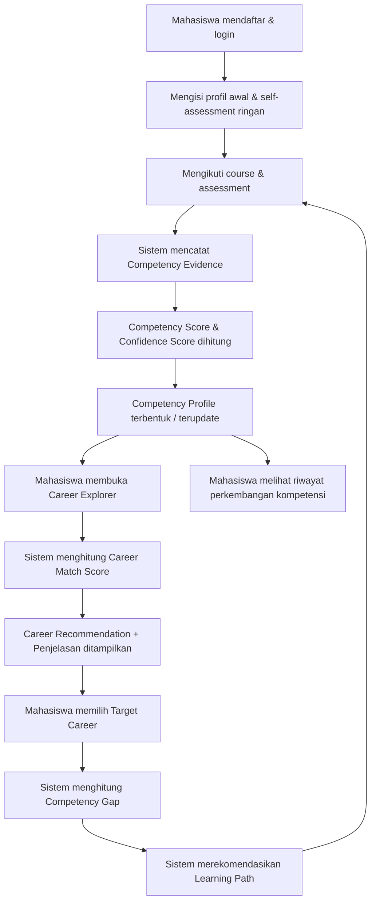
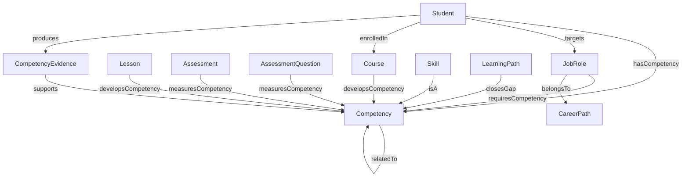
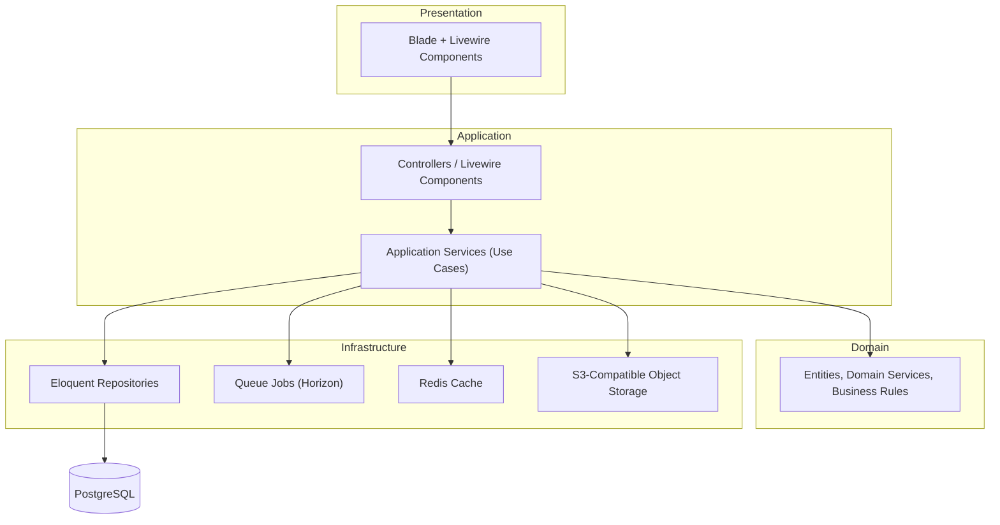

# Product Requirements Document (PRD)

# Competency-Based Learning Management System for Information Systems Students

**Versi Dokumen:** 1.0 (Draft Pertama)
**Status:** Draft untuk direview oleh Product Owner
**Disusun oleh:** AI Senior PM / System Analyst / Software Architect (atas permintaan Product Owner)

---

## Legenda / Cara Membaca Dokumen Ini

Untuk memisahkan **kebutuhan produk** dari **saran implementasi teknis** secara eksplisit sesuai permintaan, digunakan penanda berikut di sepanjang dokumen:

| Penanda | Arti |
|---|---|
| *(tanpa penanda)* | **Product Requirement** — apa yang harus dipenuhi sistem, independen dari teknologi |
| **[Technical Suggestion]** | Saran implementasi teknis (library, pola arsitektur, teknik) — dapat diganti selama requirement tetap terpenuhi |
| > 📌 **PM Note / Kritik** | Catatan kritis dari penyusun PRD terhadap requirement awal — potensi overengineering, risiko metodologis, atau saran perbaikan |
| > ⚠️ **Risk** | Risiko yang perlu diperhatikan |

---

## Assumptions

Karena instruksi eksplisit meminta PRD versi pertama dibuat tanpa bertanya balik di awal, berikut adalah **asumsi-asumsi** yang digunakan dalam penyusunan dokumen ini. Semua asumsi ini perlu dikonfirmasi oleh Product Owner (lihat *Decisions Needed From Product Owner* di bagian akhir).

1. Konteks produk kemungkinan besar adalah **proyek skripsi/tugas akhir atau produk internal satu institusi pendidikan**, bukan produk SaaS multi-kampus komersial. MVP diasumsikan **single-institution, single-tenant**.
2. Tidak ada kebutuhan integrasi wajib dengan SIAKAD/SSO kampus di MVP. Autentikasi diasumsikan mandiri (email/NIM + password); integrasi SSO/SIAKAD masuk roadmap Phase 2.
3. Tim pengembang diasumsikan **kecil (1–4 orang)**, sehingga arsitektur modular monolith dan single-language stack (Laravel-centric) diprioritaskan dibanding microservices atau stack terpisah frontend/backend penuh.
4. Primary user adalah **mahasiswa S1 Sistem Informasi**; dosen adalah secondary user pengelola konten. Program vokasi/pascasarjana dapat menyusul di roadmap.
5. Seluruh bobot evidence, threshold match score, dan band interpretasi pada dokumen ini adalah **nilai default awal (starting configuration)**, bukan angka yang sudah tervalidasi secara empiris — validasi dijelaskan di Section 40.
6. Course content diasumsikan dibuat oleh dosen sendiri (tanpa tim instructional designer terpisah).
7. Target skala awal: **~2.000–5.000 mahasiswa aktif**, puluhan dosen, ratusan course — dipakai sebagai acuan non-functional requirement MVP. Angka final perlu dikonfirmasi.
8. Tidak ada kebutuhan multi-bahasa penuh di MVP; UI utama Bahasa Indonesia, istilah teknis boleh Bahasa Inggris.
9. Deployment diasumsikan **cloud-hosted** (bukan on-premise kampus tanpa akses internet keluar), agar object storage, queue worker, dan scaling lebih mudah.
10. "Job Role" dan "Career Path" di MVP bersifat **kurasi manual oleh admin/komite kurikulum**, bukan hasil scraping otomatis dari job portal — untuk menjaga kualitas dan validitas data (lihat kritik ontology & recommendation di Section 14–15).

---

# 1. Executive Summary

Sistem ini adalah **Competency-Based Learning Management System (CB-LMS)** untuk mahasiswa Sistem Informasi yang menggabungkan empat kapabilitas dalam satu platform terpadu:

1. **Learning Management System (LMS)** — pengelolaan course, materi, dan assessment standar.
2. **Competency Management System** — pengukuran kompetensi mahasiswa berbasis evidence (bukan sekadar nilai mata kuliah).
3. **Career Recommendation System** — pencocokan kompetensi mahasiswa dengan kebutuhan pekerjaan di bidang IS/IT, menggunakan **rule-based + weighted scoring engine yang transparan dan auditable** (bukan black-box AI).
4. **Ontology-Inspired Knowledge Model** — model relasi terstruktur antara Competency, Skill, Course, Assessment, dan Job Role sebagai fondasi seluruh perhitungan.

Nilai inti produk: mahasiswa tidak hanya "belajar", tetapi memahami **kompetensi apa yang sudah mereka miliki, pekerjaan apa yang cocok, seberapa besar kecocokannya, apa yang masih kurang, dan apa langkah belajar berikutnya** — dan semua jawaban itu **bisa dijelaskan (explainable)**, bukan sekadar rekomendasi ajaib dari algoritma tertutup.

PRD ini mendefinisikan MVP yang fokus pada loop inti (*assessment → competency → recommendation → gap → learning path*), arsitektur **Laravel modular monolith + PostgreSQL**, model data konseptual, desain algoritma rekomendasi, serta strategi validasi, testing, dan roadmap jangka panjang.

> 📌 **PM Note / Kritik:** Requirement awal sangat ambisius dan mencakup scope yang setara dengan produk enterprise matang (LMS + Talent Intelligence Platform + Ontology Engine). PRD ini secara sengaja **memangkas scope MVP secara agresif** (lihat Section 32) agar realistis dikerjakan tim kecil dalam waktu terbatas, sambil tetap menyiapkan fondasi arsitektur untuk berkembang sesuai visi penuh.

---

# 2. Product Vision

**Visi 3–5 tahun:**

> "Menjadi sistem pembelajaran yang membantu setiap mahasiswa Sistem Informasi memahami dengan jelas siapa dirinya secara kompeten, ke arah karier mana ia paling cocok, dan langkah belajar apa yang paling efektif untuk sampai ke sana — didukung oleh data evidence yang objektif, bukan tebakan."

Dalam jangka panjang, sistem diharapkan menjadi **"competency backbone"** program studi: satu sumber kebenaran tentang kompetensi mahasiswa yang dapat dipakai untuk keperluan akademik (evaluasi kurikulum), karier (rekomendasi pekerjaan), maupun institusional (akreditasi, tracer study, laporan capaian pembelajaran).

---

# 3. Background & Problem Statement

**Masalah yang diamati:**

- Mahasiswa Sistem Informasi umumnya lulus dengan **transkrip nilai**, tetapi transkrip nilai **tidak menjawab pertanyaan "saya cocok kerja apa?"** — nilai mata kuliah adalah proxy yang kasar terhadap kompetensi riil.
- LMS yang ada (Moodle, Google Classroom, dsb.) berhenti di level *"course completion"* — tidak ada lapisan yang menerjemahkan aktivitas belajar menjadi **profil kompetensi** yang dapat dibandingkan dengan kebutuhan industri.
- Mahasiswa sering memilih jalur karier berdasarkan tren atau ikut-ikutan, bukan berdasarkan **kesesuaian kompetensi aktual** yang mereka miliki.
- Ketika mahasiswa sadar ada gap kompetensi, tidak ada mekanisme sistematis yang mengarahkan mereka ke materi belajar yang tepat untuk menutup gap tersebut.
- Dari sisi program studi, tidak ada data agregat yang mudah diakses tentang **kompetensi apa yang paling lemah di seluruh angkatan**, yang sebenarnya sangat berguna untuk evaluasi kurikulum.

**Mengapa sekarang / mengapa penting:**

Bidang Sistem Informasi mencakup spektrum karier yang sangat luas (technical hingga business-facing), sehingga kebutuhan untuk memetakan kompetensi ke career path jauh lebih relevan dibanding jurusan dengan satu jalur karier tunggal.

---

# 4. Product Goals

| # | Goal |
|---|---|
| G1 | Memberikan mahasiswa **profil kompetensi yang terukur dan berbasis evidence**, bukan self-klaim semata |
| G2 | Memungkinkan mahasiswa **menemukan career path yang paling sesuai** dengan kompetensi aktual mereka, lengkap dengan skor kecocokan yang dapat dijelaskan |
| G3 | Menutup gap kompetensi mahasiswa melalui **rekomendasi belajar yang terarah**, bukan menyerahkan mahasiswa mencari sendiri |
| G4 | Menjaga seluruh proses rekomendasi **transparan, deterministik, dan auditable** — dapat dijelaskan kapan pun diminta |
| G5 | Menyediakan fungsi LMS standar yang cukup kuat sehingga institusi tidak perlu sistem LMS terpisah untuk MVP |
| G6 | Memberi dosen dan program studi **visibilitas agregat** terhadap kompetensi mahasiswa untuk mendukung evaluasi kurikulum |
| G7 | Membangun arsitektur yang **dapat berkembang** (ontology formal, ML, integrasi eksternal) tanpa perlu rewrite besar-besaran |

---

# 5. Non-Goals

Agar scope tetap terkendali, secara eksplisit sistem ini **bukan**:

- **Bukan job board / platform rekrutmen** — sistem tidak menghubungkan mahasiswa langsung ke lowongan kerja riil atau perusahaan. Career recommendation bersifat edukatif/pengarah belajar, bukan matching ke posisi lowongan aktual.
- **Bukan pengganti SIAKAD/SIA kampus** — data administratif akademik (KRS, IPK resmi, keuangan) tetap berada di sistem akademik institusi; sistem ini fokus pada layer kompetensi.
- **Bukan platform LMS generik untuk semua jurusan** di MVP — model competency dan job role dirancang khusus untuk domain Sistem Informasi/IT.
- **Bukan sistem berbasis black-box AI/ML** di MVP — seluruh rekomendasi harus rule-based dan explainable (lihat Section 9, 15).
- **Bukan marketplace course** — tidak ada mekanisme jual-beli course, payment, atau instructor payout di MVP.
- **Bukan platform sosial/forum diskusi tingkat lanjut** — kolaborasi sosial bukan value proposition inti.

> 📌 **PM Note / Kritik:** Requirement awal menyebutkan job role "Data Analyst, Business Analyst, dst." sebagai contoh — penting ditegaskan bahwa sistem ini **tidak** memvalidasi kecocokan terhadap lowongan riil di pasar kerja saat ini, karena itu memerlukan integrasi data eksternal (job portal) yang jauh melebihi scope MVP dan berisiko menyesatkan mahasiswa apabila datanya tidak dikurasi dengan baik.

---

# 6. Target Users & Personas

## 6.1 Student (Primary User)

> **Persona: Rani, Mahasiswa Semester 6 Sistem Informasi**
> Rani sudah mengambil >15 mata kuliah tapi bingung mau spesialisasi ke arah mana. Ia tahu nilai algoritmanya bagus tapi tidak tahu apakah itu cukup untuk jadi Software Developer atau lebih cocok ke Business Analyst. Ia butuh **bukti objektif**, bukan sekadar insting.

Kebutuhan: assessment, course, competency profile, competency score, career recommendation, job match %, competency gap, recommended learning path, progress tracking, riwayat perkembangan kompetensi.

## 6.2 Lecturer / Instructor

> **Persona: Pak Budi, Dosen Basis Data**
> Pak Budi ingin tahu apakah materinya benar-benar meningkatkan kompetensi "Database Design" mahasiswanya, bukan cuma nilai ujian. Ia juga ingin memberi assessment manual untuk proyek tanpa harus menebak-nebak kompetensi apa yang terukur.

Kebutuhan: course/material/assessment authoring, mapping course↔competency dan question↔competency, manual assessment, monitoring progres dan analytics mahasiswa.

## 6.3 Administrator

> **Persona: Sarah, Admin Sistem Akademik Prodi**
> Sarah mengelola data master: user, competency taxonomy, job role, dan aturan rekomendasi. Ia butuh kontrol penuh tanpa harus mengedit kode program setiap kali ada job role baru atau bobot kompetensi berubah.

Kebutuhan: user & role management, master competency, job role, rule engine configuration, course/learning path management, analytics & reports, system configuration.

## 6.4 Role Tambahan yang Diusulkan: Curriculum/Competency Committee *(baru)*

> 📌 **PM Note:** Requirement awal hanya menyebut 3 role. Saya mengusulkan **role ke-4**: **Curriculum/Competency Committee** (mis. Kaprodi atau tim kurikulum), dengan alasan berikut:
>
> - Menentukan **job-competency requirement** (mis. "Data Analyst butuh SQL bobot 30%") adalah **keputusan domain akademik/industri**, bukan keputusan teknis-administratif seperti reset password atau kelola server.
> - Mencampur wewenang ini ke dalam role "Administrator" berisiko: (a) validitas data job-competency mapping tidak terjamin karena dikerjakan oleh staf teknis, bukan pakar domain, dan (b) sulit membangun *approval workflow* di masa depan (lihat Section 40 — validasi expert) jika role-nya tidak terpisah sejak awal.
> - **Untuk MVP**, role ini **boleh dijalankan oleh akun Admin yang sama** secara operasional (tidak perlu UI terpisah penuh), tetapi sistem **permission harus tetap membedakan** `competency.manage`, `job_role.manage`, `job_competency_requirement.approve` sebagai permission group tersendiri — agar pemisahan role penuh dapat diaktifkan di Phase 2 tanpa redesign skema.

Kebutuhan (skala Should Have untuk permission granular; operasional bisa memakai akun Admin di MVP): mereview dan menyetujui perubahan master competency taxonomy dan job-competency requirement sebelum berlaku aktif.

---

# 7. Jobs To Be Done (JTBD)

| User | Job To Be Done |
|---|---|
| Student | "Ketika saya bingung soal arah karier, saya ingin tahu pekerjaan apa yang paling cocok dengan kemampuan saya **saat ini**, agar saya tidak salah pilih jalur dan tidak buang waktu belajar hal yang tidak relevan." |
| Student | "Ketika saya sudah punya target karier, saya ingin tahu **persisnya apa yang kurang** dan **urutan belajar apa** yang paling efisien untuk menutupnya." |
| Lecturer | "Ketika saya mengajar, saya ingin tahu apakah course saya benar-benar membangun kompetensi yang diklaim, dan mahasiswa mana yang tertinggal di kompetensi tertentu." |
| Admin | "Ketika ada pekerjaan baru relevan atau kebutuhan kompetensi berubah, saya ingin bisa mengubah konfigurasi tanpa deploy ulang aplikasi." |

---

# 8. Value Proposition

**Bagi mahasiswa:**
Profil kompetensi yang objektif dan berbasis bukti + rekomendasi karier yang **bisa dijelaskan** ("kenapa direkomendasikan", bukan sekadar skor) + jalur belajar konkret untuk menutup gap — semuanya dalam satu platform yang juga menjadi tempat mereka belajar sehari-hari.

**Bagi dosen:**
Visibilitas terhadap efektivitas materi ajar terhadap kompetensi riil, bukan sekadar nilai ujian.

**Bagi program studi/institusi:**
Data agregat kompetensi mahasiswa untuk evaluasi kurikulum, dan diferensiasi produk akademik (competency-based education) yang dapat mendukung akreditasi maupun riset (skripsi/tesis terkait employability mahasiswa).

---

# 9. Core Product Principles

1. **Explainable** — setiap skor dan rekomendasi harus bisa dijelaskan asal-usulnya.
2. **Transparent** — formula dan bobot dapat dilihat (minimal oleh admin), tidak tersembunyi dalam "kotak hitam".
3. **Evidence-based** — competency score berasal dari bukti aktivitas nyata, bukan klaim sepihak.
4. **Auditable** — setiap rekomendasi menyimpan snapshot input dan versi rule yang dipakai.
5. **Modular** — domain-domain sistem (Competency, Career, Ontology, dst.) dipisah dengan boundary jelas agar dapat berkembang independen.
6. **Maintainable & Extensible** — perubahan bobot/rule/job role dilakukan lewat konfigurasi, bukan perubahan kode.
7. **Secure** — data kompetensi dan penilaian adalah data sensitif akademik, harus dilindungi setara data akademik resmi.
8. **Not Overengineered** — kompleksitas (mis. formal ontology, ML) hanya ditambahkan ketika ada bukti kebutuhan nyata, bukan di muka.
9. **Not Dependent on Black-Box AI** — MVP tidak boleh bergantung pada model AI yang tidak dapat dijelaskan alasannya.

---

# 10. High-Level User Journey



**Narasi:** Loop ini adalah **jantung produk**. Setiap kali mahasiswa menyelesaikan aktivitas belajar baru, competency profile diperbarui, yang berpotensi mengubah career match score dan gap — sehingga rekomendasi selalu mencerminkan kondisi terbaru mahasiswa, bukan snapshot statis satu kali.

---

# 11. System Roles & Permissions

**Matriks permission tingkat tinggi** (detail granular permission ada di level implementasi/Section 25):

| Kapabilitas | Student | Lecturer | Admin | Curriculum Committee* |
|---|:---:|:---:|:---:|:---:|
| Mengikuti course & assessment | ✅ | – | – | – |
| Membuat/mengedit course, lesson, assessment miliknya | – | ✅ | ✅ (semua) | – |
| Melihat competency profile sendiri | ✅ | – | – | – |
| Melihat competency profile mahasiswa lain | – | ✅ (kelasnya) | ✅ (semua) | ✅ (agregat) |
| Melakukan manual grading/assessment | – | ✅ | ✅ | – |
| Mengelola master competency & hierarchy | – | – | ✅ | ✅ (approve) |
| Mengelola job role & job-competency requirement | – | – | ✅ | ✅ (approve) |
| Mengatur recommendation rule/weight/threshold | – | – | ✅ | ✅ (approve) |
| Melihat career recommendation & gap sendiri | ✅ | – | – | – |
| Melihat analytics kelas | – | ✅ | ✅ | ✅ |
| Melihat analytics institusi | – | – | ✅ | ✅ |
| Mengelola user & role | – | – | ✅ | – |
| Melihat audit log | – | – | ✅ | ✅ (terkait competency/rule) |

*\*Untuk MVP, kolom Curriculum Committee secara operasional dijalankan oleh akun Admin (lihat Section 6.4), tetapi permission group tetap dipisah di level sistem.*


# 12. Functional Requirements

*(FR = Functional Requirement, dikelompokkan per module. Ini adalah requirement fungsional, bukan MoSCoW — prioritisasi MVP ada di Section 32.)*

## 12.1 Authentication & User Management

- FR-AUTH-01: Sistem mendukung login berbasis email/username + password.
- FR-AUTH-02: Sistem mendukung role-based access control (RBAC) dengan minimal role: Student, Lecturer, Admin (+ permission group Curriculum Committee).
- FR-AUTH-03: Sistem mendukung reset password via email.
- FR-AUTH-04: Admin dapat membuat, menonaktifkan, dan mengelola akun user secara manual maupun bulk import.
- FR-AUTH-05: **[Should Have]** Sistem mendukung Multi-Factor Authentication opsional untuk akun Admin/Lecturer.
- FR-AUTH-06: Setiap user memiliki profil dasar (nama, email, foto, dan atribut spesifik role — mis. NIM/angkatan untuk Student, bidang keahlian untuk Lecturer).

## 12.2 LMS — Course Management

- FR-LMS-01: Lecturer/Admin dapat membuat course dengan judul, deskripsi, kategori, thumbnail, prerequisite, objective, dan learning outcome.
- FR-LMS-02: Course memiliki status: Draft → Review → Published → Archived.
- FR-LMS-03: Course dapat dipetakan ke satu atau lebih Competency beserta tingkat kontribusinya (lihat Section 13).
- FR-LMS-04: Course tersusun atas Section → Lesson.
- FR-LMS-05: Lesson mendukung tipe konten: Text, Video, PDF/Document, External Link, Quiz, Assignment, Project, Case Study.
- FR-LMS-06: Sistem mendukung enrollment: manual, self-enrollment, group/cohort enrollment.
- FR-LMS-07: Sistem melacak progress: course started, lesson started/completed, quiz/assignment completed, course completed, last activity, completion percentage.

## 12.3 Assessment

- FR-ASM-01: Sistem mendukung tipe soal: single choice, multiple choice, true/false, short answer, essay, practical assessment, project assessment.
- FR-ASM-02: Assessment memiliki konfigurasi: passing score, max attempt, time limit, randomisasi soal & jawaban, open/close date.
- FR-ASM-03: Sistem mendukung automatic grading (tipe objektif) dan manual grading (essay, practical, project).
- FR-ASM-04: Setiap Assessment Question dapat dipetakan ke satu atau lebih Competency yang diukur, dengan bobot kontribusi.
- FR-ASM-05: Hasil assessment menghasilkan **skor total** DAN **skor per-competency** (bukan hanya skor agregat).
- FR-ASM-06: Sistem mencatat setiap attempt (jawaban, waktu mulai/selesai, skor) untuk audit dan analitik.

## 12.4 Competency Management

- FR-CMP-01: Admin/Curriculum Committee dapat membuat, mengedit, menonaktifkan (soft-delete) master Competency, termasuk kategori dan hierarchy (parent/child/related).
- FR-CMP-02: Setiap Competency memiliki proficiency model 0–5 (lihat Section 13).
- FR-CMP-03: Sistem menghitung Competency Score dan Confidence Score mahasiswa berdasarkan evidence (lihat Section 13, 15).
- FR-CMP-04: Sistem mencatat Competency Evidence dari berbagai sumber (quiz, assessment, project, course completion, lecturer assessment, self-assessment).
- FR-CMP-05: Sistem menyimpan histori perubahan Competency Score per waktu (Competency Score History).
- FR-CMP-06: Sistem mencegah **cyclic relationship** dalam competency hierarchy (validasi saat admin menyimpan relasi).

## 12.5 Ontology Management

- FR-ONT-01: Admin dapat mendefinisikan relasi antar entitas ontology: `hasCompetency`, `developsCompetency`, `measuresCompetency`, `requiresCompetency`, `broaderThan`, `narrowerThan`, `relatedTo`, `isA`, `belongsTo`.
- FR-ONT-02: Sistem menyediakan visualisasi/browse hierarchy competency (tree/graph view) untuk Admin dan (read-only, sebatas relevan) Student.
- FR-ONT-03: Sistem melakukan validasi konsistensi relasi (no cycle, no orphan reference) setiap kali relasi disimpan.

## 12.6 Career Management

- FR-CAR-01: Admin dapat membuat Job Role dengan nama, deskripsi, kategori karier, dan daftar Competency Requirement (mandatory/optional/recommended, minimum level, weight).
- FR-CAR-02: Admin dapat mendefinisikan Career Path (urutan progresi job role) dan Related Job Role.
- FR-CAR-03: Sistem memvalidasi bahwa total weight competency requirement per Job Role konsisten (lihat Section 19, Business Rules).

## 12.7 Recommendation Engine

- FR-REC-01: Sistem menghitung Career Match Score untuk setiap Job Role aktif terhadap profil kompetensi mahasiswa, secara deterministik berdasarkan rule versi aktif.
- FR-REC-02: Sistem menghasilkan penjelasan (explanation) untuk setiap rekomendasi: kompetensi kuat, sedang, dan gap.
- FR-REC-03: Sistem menyimpan snapshot rule version dan input yang dipakai pada setiap proses rekomendasi (auditability).
- FR-REC-04: Admin dapat mengubah bobot/threshold/rule tanpa mengubah kode program, dan perubahan tersebut membentuk versi rule baru (rule lama tidak dihapus).
- FR-REC-05: Mahasiswa dapat memberikan feedback (mis. helpful/not helpful) terhadap rekomendasi yang diterima. **[Should Have]**

## 12.8 Competency Gap Analysis

- FR-GAP-01: Untuk target career terpilih, sistem menghitung selisih (gap) antara required competency level dan current competency level mahasiswa, per competency.
- FR-GAP-02: Sistem mengurutkan gap berdasarkan prioritas (mis. mandatory competency dengan gap terbesar diprioritaskan).

## 12.9 Learning Path

- FR-LP-01: Sistem dapat men-generate Learning Path otomatis berdasarkan competency gap.
- FR-LP-02: Admin/Lecturer dapat membuat Learning Path manual.
- FR-LP-03: Learning Path memiliki urutan, prerequisite antar item, serta status mandatory/optional per item.
- FR-LP-04: Sistem melacak progress mahasiswa terhadap Learning Path yang diikuti.

## 12.10 Dashboard

- FR-DSH-01: Student Dashboard menampilkan: competency profile, radar chart kompetensi, top/weak competencies, rekomendasi karier, target career terpilih, gap, learning path aktif, course aktif, riwayat assessment, progres kompetensi dari waktu ke waktu.
- FR-DSH-02: Lecturer Dashboard menampilkan course yang diampu, progres mahasiswa, dan distribusi kompetensi kelas.
- FR-DSH-03: Admin Dashboard menampilkan ringkasan sistem (jumlah user, course, assessment, gap terbanyak, career terbanyak direkomendasikan).

## 12.11 Analytics & Reporting

- FR-ANL-01: Sistem menyediakan analytics per role sesuai Section "Analytics" pada requirement awal (student/lecturer/admin).
- FR-ANL-02: Report berat (mis. distribusi kompetensi seluruh institusi) diproses melalui background job, bukan real-time synchronous request.

## 12.12 Notifications

- FR-NOT-01: **[Should Have]** Sistem mengirim notifikasi in-app untuk event penting: rekomendasi baru dihasilkan, assessment dinilai, course baru ditugaskan, learning path item selesai.

## 12.13 Audit Log

- FR-AUD-01: Sistem mencatat audit log untuk seluruh perubahan data master (competency, job role, rule) dan seluruh proses generate rekomendasi.
- FR-AUD-02: Audit log bersifat append-only dan tidak dapat diedit/dihapus melalui aplikasi.

---

# 13. Competency Model

## 13.1 Atribut Competency

Setiap Competency memiliki:

| Atribut | Keterangan |
|---|---|
| `parent_competency` | Competency induk (hierarchy) — nullable |
| `related_competencies` | Daftar competency terkait (many-to-many, non-hierarkis) |
| `category` | Kategori (Software Development, Data, Business Analysis, dst.) |
| `proficiency_model` | Skala 0–5 (lihat 13.2) |
| `evidence[]` | Daftar bukti yang mendukung skor mahasiswa terhadap competency ini |
| `competency_score` | Skor 0–100 per mahasiswa (hasil kalkulasi, bukan atribut master) |
| `confidence_score` | Skor 0–100 per mahasiswa (hasil kalkulasi) |

## 13.2 Proficiency Level Model

Model level dari requirement awal **dipertahankan** dengan penambahan band skor numerik agar konsisten dan dapat dihitung otomatis:

| Level | Label | Rentang Skor (0–100) | Deskripsi |
|---|---|---|---|
| 0 | Not Assessed | *(tidak ada evidence)* | Belum ada data/evidence sama sekali |
| 1 | Awareness | 1–20 | Mengetahui konsep dasar, belum bisa aplikasi mandiri |
| 2 | Beginner | 21–40 | Bisa mengerjakan tugas sederhana dengan bimbingan |
| 3 | Intermediate | 41–60 | Bisa mengerjakan tugas standar secara mandiri |
| 4 | Advanced | 61–80 | Bisa menangani kasus kompleks, membantu orang lain |
| 5 | Expert | 81–100 | Menguasai secara mendalam, dapat menjadi rujukan/mentor |

> 📌 **PM Note / Kritik:** Model Dreyfus (Novice→Expert) atau taksonomi yang lebih akademis bisa dipertimbangkan sebagai landasan teoritis (baik untuk keperluan skripsi), tetapi **untuk implementasi sistem, skala 0–5 dengan band skor numerik di atas sudah cukup dan lebih mudah dihitung otomatis serta dijelaskan ke mahasiswa**. Menambah granularitas level berisiko overengineering tanpa manfaat praktis yang jelas di MVP.

## 13.3 Competency Score — Formula

Competency Score dihitung dari **weighted average evidence**, bukan rata-rata sederhana:

```text
CompetencyScore = Σ (EvidenceScore_i × EvidenceTypeWeight_i)
                   ─────────────────────────────────────────
                        Σ (EvidenceTypeWeight_i)
```

Default bobot tipe evidence (dapat dikonfigurasi Admin, harus berjumlah 100%):

| Evidence Type | Default Weight |
|---|---|
| Project / Practical Assessment | 35% |
| Technical Assessment (quiz/exam objektif+essay) | 30% |
| Course Performance (completion + nilai course) | 20% |
| Self-Assessment | 15% |

> 📌 **PM Note / Kritik:** Requirement awal memberi contoh bobot ini sebagai contoh umum, bukan per-competency. **Rekomendasi:** untuk MVP, gunakan **satu set bobot global** seperti di atas (sederhana, mudah dijelaskan). Bobot berbeda **per kategori competency** (mis. Soft Skills mungkin lebih bergantung pada self/lecturer assessment) adalah **[Should Have]**, bukan Must Have — untuk menghindari kompleksitas konfigurasi yang berlebihan di awal.

**Self-assessment safeguard:** karena self-assessment rawan bias/inflasi, bobot 15% adalah **cap maksimum kontribusinya terhadap skor resmi**, dan self-assessment **tidak dapat menaikkan level Competency di atas Level 2 (Beginner)** tanpa didukung minimal satu evidence non-self-assessment. Ini mencegah mahasiswa "self-rate expert" tanpa bukti.

**Recency decay:** **[Should Have — Phase 2]**. Di MVP, seluruh evidence yang masih berlaku (belum expired, lihat Section 31) dihitung dengan bobot penuh tanpa decay berdasarkan usia, demi kesederhanaan. Decay berbasis waktu dapat ditambahkan setelah data historis cukup untuk dikalibrasi.

## 13.4 Confidence Score — Formula

Confidence Score menjawab pertanyaan: **"seberapa yakin sistem terhadap Competency Score ini?"** — penting agar mahasiswa tidak salah percaya pada skor yang dihitung dari 1 evidence saja.

```text
ConfidenceScore = EvidenceCountFactor + EvidenceDiversityFactor + RecencyFactor
```

| Komponen | Bobot Maks | Formula |
|---|---|---|
| Evidence Count Factor | 40 | `min(evidence_count / expected_min_count, 1) × 40` |
| Evidence Diversity Factor | 30 | `(distinct_evidence_types_used / total_possible_types) × 30` |
| Recency Factor | 30 | 30 jika evidence terbaru < 6 bulan; 20 jika 6–12 bulan; 10 jika >12 bulan; 0 jika tidak ada |

`expected_min_count` adalah konfigurasi per competency category (default: 3 evidence). Confidence Score ditampilkan berdampingan dengan Competency Score di UI (mis. "SQL: 78 — Confidence: Tinggi"), sehingga mahasiswa dan sistem rekomendasi memperlakukan skor dengan sedikit evidence secara lebih hati-hati.

> 📌 **PM Note:** Ini menjawab pertanyaan wajib #8 dari requirement ("Bagaimana confidence score dihitung?") secara eksplisit dan deterministik — tidak menggunakan ML.

---

# 14. Ontology Model

## 14.1 Diagram Konseptual



## 14.2 Option A vs Option B

| Aspek | Option A — Relational (PostgreSQL) | Option B — Formal Semantic Web (RDF/OWL/Protégé/SPARQL) |
|---|---|---|
| Kompleksitas implementasi | Rendah–Sedang | Tinggi |
| Kecepatan query transaksional | Cepat (native SQL, index) | Lebih lambat untuk query transaksional biasa, kuat untuk reasoning |
| Konsistensi transaksi (ACID) | Native (PostgreSQL) | Perlu infrastruktur tambahan (triple store) |
| Reasoning/inferensi otomatis (mis. transitive `isA`) | Manual via recursive query/CTE | Native via reasoner (mis. HermiT, Pellet) |
| Interoperabilitas standar (ESCO, O*NET, SKOS) | Rendah (perlu mapping manual) | Tinggi (format standar industri) |
| Kurva belajar tim | Rendah (tim Laravel/SQL sudah familiar) | Tinggi (perlu keahlian Semantic Web khusus) |
| Tooling ekosistem Laravel | Native/matang | Minim, perlu bridge/integrasi eksternal |
| Cocok untuk MVP tim kecil | ✅ Sangat cocok | ❌ Berisiko overengineering |
| Cocok untuk penelitian/skripsi terkait ontology formal | Kurang "murni" secara akademis | ✅ Lebih kuat secara akademis jika itu fokus riset |

**Rekomendasi:**

> 📌 **PM Note / Kritik:** Requirement awal meminta PRD membahas dan merekomendasikan salah satu. **Rekomendasi tegas: gunakan Option A untuk MVP dan seluruh roadmap jangka menengah.** Alasan:
> 1. Tim kecil dengan stack Laravel akan jauh lebih produktif dengan model relational yang familiar.
> 2. Kebutuhan fungsional (hierarchy competency, requirement job role, weighted scoring) **tidak memerlukan reasoning kompleks** — cukup dijawab dengan recursive CTE (`WITH RECURSIVE`) di PostgreSQL untuk traversal hierarchy `broaderThan`/`narrowerThan`.
> 3. Formal ontology (RDF/OWL/Protégé/SPARQL) menambah **operational complexity signifikan** (triple store terpisah, reasoner, sinkronisasi dua sumber data) yang tidak sepadan dengan manfaatnya di tahap ini — ini contoh nyata *overengineering* yang diminta untuk dikritik.
> 4. **Namun**, jika tujuan proyek juga mencakup **kontribusi akademis/riset** (mis. untuk skripsi dengan fokus ontology engineering), Option B dapat dijadikan **eksperimen paralel/Phase 3**: model relational Option A di-*export* ke OWL (mis. via skrip generate RDF triples dari tabel `competencies`/`competency_relations`) untuk keperluan riset atau interoperabilitas dengan taksonomi standar seperti ESCO — **tanpa menjadikannya dependency sistem produksi**.
> 5. Istilah "ontology" pada PRD ini selanjutnya merujuk pada **model ontology-inspired yang diimplementasikan secara relational** (Option A), bukan Semantic Web formal.

## 14.3 Representasi Relasi di Option A

| Relasi Ontology | Implementasi Tabel |
|---|---|
| `hasCompetency` | `student_competencies` |
| `developsCompetency` | `course_competencies`, `lesson_competencies` |
| `measuresCompetency` | `assessment_competencies`, `question_competencies` |
| `requiresCompetency` | `job_competency_requirements` |
| `broaderThan` / `narrowerThan` | `competencies.parent_competency_id` (self-referencing FK) |
| `relatedTo` | `competency_relations` (tipe `related`) |
| `isA` (Skill → Competency) | Skill dimodelkan sebagai Competency dengan `category = 'Skill'` atau flag `is_skill`, bukan tabel terpisah (lihat kritik 14.4) |
| `belongsTo` (JobRole → CareerPath) | `job_roles.career_path_id` |

## 14.4 Kritik terhadap Pemodelan "Skill" sebagai Entitas Terpisah

> 📌 **PM Note / Kritik:** Requirement awal memodelkan `Skill` sebagai entitas terpisah dari `Competency` dengan relasi `Skill isA Competency`. **Rekomendasi: JANGAN membuat tabel `skills` terpisah.** Perlakukan Skill sebagai **Competency pada level hierarchy paling bawah** (leaf node), dibedakan lewat atribut (`level_type = 'skill' | 'competency_group'`) bukan tabel terpisah. Alasan: relasi `isA` antara dua konsep yang secara struktural identik (sama-sama punya nama, kategori, proficiency, evidence) hanya menambah join dan kompleksitas tanpa manfaat semantik tambahan — cukup direpresentasikan sebagai satu hierarchy `Competency` saja (PostgreSQL, Relational Database Skill, Database Competency, Data Competency semuanya adalah baris di tabel `competencies` dengan `parent_competency_id` berjenjang).


# 15. Recommendation System Design

## 15.1 Prinsip Desain

Engine menggabungkan **Ontology (relasi requiresCompetency) + Weighted Scoring + Rule-Based Gating**, seluruhnya deterministik (tanpa randomness/ML), sehingga hasil yang sama pada input yang sama **selalu** menghasilkan output yang sama.

## 15.2 Formula Match Score

```text
MatchScore(Student, JobRole) =
    Σ ( StudentCompetencyScore_i × JobCompetencyWeight_i )
    ────────────────────────────────────────────────────────
              Σ ( JobCompetencyWeight_i )

   untuk seluruh i ∈ { competency requirement JobRole tsb }
```

Jika mahasiswa belum punya evidence pada suatu competency yang di-*require* (Competency Score = *Not Assessed*), `StudentCompetencyScore_i` diperlakukan sebagai **0**, bukan diskip dari perhitungan — agar tidak "menguntungkan" mahasiswa yang belum pernah dinilai dibanding yang sudah dinilai rendah.

## 15.3 Mandatory Competency Gating (Perbaikan atas Requirement Awal)

> 📌 **PM Note / Kritik:** Formula weighted-average murni pada requirement awal punya kelemahan: mahasiswa bisa mendapat **match score tinggi meski benar-benar tidak menguasai satu competency yang sifatnya wajib mutlak**, selama competency lain kuat. Ini bisa menyesatkan. Solusi: tambahkan **gating rule** di atas weighted score.

**Rule:**
- Setiap `job_competency_requirement` memiliki `requirement_type`: `mandatory`, `optional`, atau `recommended`, serta `minimum_level` (0–5).
- Jika ada competency `mandatory` dengan `StudentCompetencyScore` di bawah `minimum_level` yang setara, maka:
  - `MatchScore` numerik **tetap dihitung dan ditampilkan** (untuk transparansi),
  - namun **Recommendation Category** dipaksa menjadi **"Not Ready"**, terlepas dari besar `MatchScore`,
  - competency yang menjadi penyebab disebut eksplisit sebagai **"Blocking Gap"** di penjelasan.

## 15.4 Interpretation Bands (Direvisi)

| Match Score | Kategori | Catatan |
|---|---|---|
| ≥ 80% dan tanpa Blocking Gap | Highly Recommended | |
| 65–79% dan tanpa Blocking Gap | Recommended | |
| 50–64% dan tanpa Blocking Gap | Potential Match | |
| < 50% | Low Match | |
| *(ada Blocking Gap, berapapun skornya)* | **Not Ready** | Override kategori manapun |

> 📌 **PM Note:** Band ini adalah **default awal yang dapat dikalibrasi**, bukan angka final (lihat Section 40 — Validation Strategy & sensitivity analysis). Threshold tetap disimpan sebagai konfigurasi (`recommendation_rule_versions`), bukan hardcode.

## 15.5 Explainability Output

Setiap hasil rekomendasi menghasilkan struktur output berikut (disimpan di `career_recommendation_details`):

```text
Job Role: Data Analyst
Match Score: 78%
Category: Recommended

Strong Competencies (score ≥ 70):
- SQL (85)
- Database Design (80)

Moderate Competencies (score 40–69):
- Statistics (60)

Competency Gaps (score < required minimum):
- Data Visualization (required 70, current 45, gap 25)
- Python for Data Analysis (required 60, current 0, gap 60)

Blocking Gaps (mandatory, di bawah minimum): none
```

## 15.6 Auditability Rule Versioning

- Setiap perubahan bobot/threshold/requirement oleh Admin **membentuk `recommendation_rule_version` baru** (immutable snapshot), bukan overwrite versi lama.
- Setiap `career_recommendation` menyimpan `rule_version_id` yang dipakai saat digenerate.
- Jika rule berubah di kemudian hari, rekomendasi historis **tetap dapat ditelusuri** menggunakan rule version yang berlaku saat itu — menjawab pertanyaan wajib #18.

---

# 16. Competency Gap Analysis Design

## 16.1 Algoritma

```text
INPUT: student_id, target_job_role_id
1. Ambil seluruh job_competency_requirements untuk target_job_role_id
2. Untuk setiap requirement:
     a. Ambil StudentCompetencyScore terkini (0 jika belum ada evidence)
     b. Hitung Gap = max(0, RequiredMinimumLevelScore - StudentCompetencyScore)
     c. Tandai severity:
          - Critical  → requirement_type = mandatory DAN gap > 0
          - Moderate  → requirement_type = optional/recommended DAN gap > 20
          - Minor     → gap 1–20 pada non-mandatory
3. Urutkan hasil: Critical dahulu, lalu Moderate, lalu Minor
   (dalam severity yang sama, urutkan berdasarkan gap terbesar)
4. OUTPUT: daftar competency + gap + severity, siap dipakai sebagai
   input Learning Path Recommendation (Section 17)
```

## 16.2 Contoh Output

| Competency | Required | Current | Gap | Severity |
|---|---|---|---|---|
| System Design | 75 | 45 | 30 | Critical |
| BPMN | 70 | 75 | 0 | – (terpenuhi) |
| Communication | 70 | 70 | 0 | – (terpenuhi) |

---

# 17. Learning Recommendation Design

## 17.1 Algoritma

```text
INPUT: daftar (competency, gap, severity) dari Gap Analysis
1. Untuk setiap competency dengan gap > 0:
     a. Cari seluruh Course/Lesson dengan relasi developsCompetency
        ke competency tsb (langsung, atau turunan/child competency-nya
        via hierarchy — lihat 17.2)
     b. Hitung "relevance score" course = kontribusi competency-nya
        terhadap gap yang dituju
     c. Filter course yang belum diselesaikan mahasiswa
2. Gabungkan seluruh course kandidat dari semua competency gap
   (deduplikasi bila satu course menutup >1 gap sekaligus — course
    yang menutup lebih banyak gap diprioritaskan/direct-boost)
3. Urutkan berdasarkan prerequisite (topological sort) — course dengan
   prerequisite course lain yang belum selesai diletakkan setelahnya
4. Susun sebagai Learning Path terurut, tandai item sebagai
   Mandatory (menutup Critical gap) atau Optional (menutup Moderate/Minor)
5. Simpan sebagai learning_path + learning_path_items,
   linked ke gap analysis & career_recommendation yang memicunya
```

## 17.2 Penanganan Hierarchy dalam Pencarian Course

Jika tidak ada course yang langsung mengembangkan competency "System Design", sistem mencari course yang mengembangkan **child competency** dari "System Design" (mis. "UML Fundamentals", "Software Architecture Basics") menggunakan recursive query pada `competency_relations`. Ini menjawab kasus di mana competency granular belum tentu punya course 1:1.

> 📌 **PM Note / Kritik:** Requirement awal tidak menjelaskan bagaimana handle competency yang **tidak ada course pendukungnya sama sekali** (competency baru/niche). **Rekomendasi:** jika tidak ditemukan course kandidat, tampilkan gap tersebut tetap di UI dengan status *"Belum ada rekomendasi course — hubungi dosen/prodi"* daripada Learning Path kosong tanpa penjelasan (lihat Section 31, edge case).

---

# 18. Career Recommendation Design

## 18.1 Alur Generate Rekomendasi

```text
1. Trigger: mahasiswa membuka Career Explorer, ATAU
   competency profile berubah signifikan (background job), ATAU
   mahasiswa memilih target career baru
2. Untuk setiap Job Role aktif:
     a. Hitung MatchScore (Section 15.2)
     b. Terapkan Mandatory Gating (Section 15.3)
     c. Tentukan Category (Section 15.4)
     d. Generate Explanation (Section 15.5)
3. Urutkan Job Role berdasarkan MatchScore descending
   (tie-break: jumlah Strong Competencies terbanyak, lalu alfabetis)
4. Simpan snapshot ke career_recommendations +
   career_recommendation_details dengan rule_version_id
5. Tampilkan Top-N (default N=10, configurable) di Career Explorer
```

## 18.2 Career Progression

`job_roles` memiliki relasi self-referencing sederhana `next_role_id` / `job_role_relations` (tipe: `progression`, `related`) untuk merepresentasikan jenjang karier (mis. Junior BA → BA → Senior BA → Lead BA).

> 📌 **PM Note / Kritik:** Requirement awal berpotensi mengarah ke **graph editor progresi karier yang kompleks** (multi-path, branching). **Untuk MVP, cukup relasi sederhana** `job_role_relations(from_role_id, to_role_id, relation_type)` yang ditampilkan sebagai daftar linear/related roles — bukan graph editor visual interaktif (itu masuk Could Have/Phase 2).

---

# 19. Core Business Rules

| ID | Rule |
|---|---|
| BR-01 | Total `weight` seluruh `job_competency_requirements` pada satu Job Role **harus berjumlah 100%** — divalidasi saat disimpan; sistem menawarkan auto-normalize jika tidak. |
| BR-02 | Competency hierarchy **tidak boleh mengandung cycle** (A broaderThan B, B broaderThan A) — divalidasi via cycle-detection saat relasi disimpan. |
| BR-03 | Competency yang sudah direferensikan oleh Job Role, Course, atau Evidence **tidak dapat di-hard-delete**, hanya soft-delete (`is_active = false`). |
| BR-04 | Recommendation Rule Version bersifat **immutable** setelah publish — perubahan bobot/threshold selalu membuat versi baru. |
| BR-05 | Self-assessment **tidak dapat mendorong level competency melebihi Level 2 (Beginner)** tanpa evidence pendukung non-self-assessment. |
| BR-06 | Attempt assessment: skor yang dipakai sebagai evidence ditentukan oleh konfigurasi per-assessment (`best_score` \| `latest_score` \| `average_score`), default `best_score`. |
| BR-07 | Mandatory competency requirement yang tidak terpenuhi **selalu meng-override kategori rekomendasi menjadi "Not Ready"**, tanpa terkecuali. |
| BR-08 | Course/Assessment yang di-Archive tetap mempertahankan evidence historis yang sudah tercatat — evidence tidak dihapus. |
| BR-09 | Recalculation Competency Score dipicu otomatis setiap ada Competency Evidence baru/berubah, diproses via background job (bukan blocking request). |
| BR-10 | Perubahan Target Career oleh mahasiswa tidak menghapus Learning Path lama — item lama ditandai `superseded`, Learning Path baru dibuat terpisah. |

# 20. Database Conceptual Design

## 20.1 Entity Relationship Overview (Mermaid)

```mermaid
erDiagram
    USERS ||--o| STUDENTS : extends
    USERS ||--o| LECTURERS : extends
    STUDENTS ||--o{ STUDENT_COMPETENCIES : has
    COMPETENCIES ||--o{ STUDENT_COMPETENCIES : "measured for"
    COMPETENCIES ||--o{ COMPETENCY_RELATIONS : "related via"
    STUDENT_COMPETENCIES ||--o{ COMPETENCY_EVIDENCES : "supported by"
    STUDENT_COMPETENCIES ||--o{ COMPETENCY_SCORE_HISTORIES : "tracked over time"
    COURSES ||--o{ COURSE_SECTIONS : has
    COURSE_SECTIONS ||--o{ LESSONS : has
    COURSES ||--o{ COURSE_COMPETENCIES : develops
    LESSONS ||--o{ LESSON_COMPETENCIES : develops
    COURSES ||--o{ ASSESSMENTS : contains
    ASSESSMENTS ||--o{ ASSESSMENT_QUESTIONS : has
    ASSESSMENT_QUESTIONS ||--o{ QUESTION_COMPETENCIES : measures
    STUDENTS ||--o{ ASSESSMENT_ATTEMPTS : attempts
    ASSESSMENTS ||--o{ ASSESSMENT_ATTEMPTS : "attempted in"
    ASSESSMENT_ATTEMPTS ||--o{ ASSESSMENT_ANSWERS : contains
    JOB_ROLES ||--o{ JOB_COMPETENCY_REQUIREMENTS : requires
    COMPETENCIES ||--o{ JOB_COMPETENCY_REQUIREMENTS : "required by"
    JOB_ROLES ||--o{ CAREER_RECOMMENDATIONS : "target of"
    STUDENTS ||--o{ CAREER_RECOMMENDATIONS : receives
    CAREER_RECOMMENDATIONS ||--o{ CAREER_RECOMMENDATION_DETAILS : "explained by"
    RECOMMENDATION_RULE_VERSIONS ||--o{ CAREER_RECOMMENDATIONS : "generated under"
    STUDENTS ||--o{ LEARNING_PATHS : follows
    LEARNING_PATHS ||--o{ LEARNING_PATH_ITEMS : contains
    STUDENTS ||--o{ ENROLLMENTS : has
    COURSES ||--o{ ENROLLMENTS : "enrolled via"
    STUDENTS ||--o{ LESSON_PROGRESS : tracks
    STUDENTS ||--o{ LEARNING_EVENTS : generates
    JOB_ROLES ||--o{ JOB_ROLE_RELATIONS : "progresses to"
    JOB_ROLES }o--o| CAREER_PATHS : "belongs to"
```



## 20.2 Kapan Menggunakan JSONB vs Kolom Relasional

> 📌 **PM Note / Kritik penting:** requirement awal tidak membahas ini secara spesifik, padahal krusial untuk desain PostgreSQL yang baik.

| Gunakan **kolom relasional** ketika | Gunakan **JSONB** ketika |
|---|---|
| Data akan di-`WHERE`, `JOIN`, `GROUP BY`, atau diberi FK/index | Data bersifat semi-terstruktur dan jarang di-query langsung |
| Butuh constraint (`CHECK`, `UNIQUE`, `NOT NULL`) yang ketat | Struktur data bisa berbeda-beda antar baris (mis. konfigurasi soal per tipe assessment) |
| Data adalah bagian dari perhitungan bisnis inti (skor, bobot, level) | Data adalah snapshot historis yang tidak perlu diubah lagi (mis. snapshot input rekomendasi lama) |

**Contoh penerapan di sistem ini:**
- `student_competencies.score`, `job_competency_requirements.weight` → **kolom relasional** (numeric, ada constraint, dipakai kalkulasi).
- `assessment_questions.options` (pilihan jawaban single/multiple choice yang jumlah opsinya bervariasi) → **JSONB** cocok.
- `career_recommendation_details.explanation_snapshot` (breakdown strong/moderate/gap competency pada saat rekomendasi digenerate) → **JSONB**, karena ini snapshot historis read-only untuk auditability, strukturnya tidak perlu di-query granular via SQL, cukup ditampilkan utuh ke UI.
- `learning_events.event_payload` (payload event yang berbeda-beda tergantung jenis event) → **JSONB**.

## 20.3 Prinsip Desain Lain

- Seluruh tabel transaksional inti menggunakan **UUID atau bigint auto-increment** sebagai PK (disarankan `bigint` untuk performa index dan volume tinggi + kolom `uuid` publik terpisah bila perlu expose ke API/URL — **[Technical Suggestion]**).
- Soft delete (`deleted_at`) diterapkan pada: `competencies`, `job_roles`, `courses`, `lessons`, `assessments`, `users` — karena entitas ini kemungkinan besar sudah direferensikan tabel lain sebelum dihapus.
- Audit trail (`created_by`, `updated_by`, `created_at`, `updated_at`) wajib di seluruh tabel master data.
- `recommendation_rule_versions` dan `career_recommendations`/`career_recommendation_details` **tidak pernah di-update setelah dibuat** — hanya insert baru (immutable log pattern).

---

# 21. Proposed PostgreSQL Schema

*(Daftar tabel penting beserta purpose, kolom kunci, PK/FK, constraint, dan index. Bukan full SQL migration.)*

### `users`
- **Purpose:** akun login seluruh role.
- **Kolom kunci:** `id (PK)`, `name`, `email (UNIQUE)`, `password_hash`, `role_id (FK→roles)`, `is_active`, `deleted_at`.
- **Index:** `email (unique)`, `role_id`.

### `students` / `lecturers`
- **Purpose:** atribut spesifik role, extends `users`.
- **Kolom kunci:** `user_id (PK, FK→users, unique)`, `nim`/`nidn`, `cohort_year`, `program_study`.
- **Constraint:** `nim UNIQUE` pada `students`.

### `competencies`
- **Purpose:** master data competency (termasuk Skill sebagai leaf node — lihat 14.4).
- **Kolom kunci:** `id (PK)`, `name`, `slug (UNIQUE)`, `category_id (FK)`, `parent_competency_id (FK→competencies, nullable, self-ref)`, `description`, `is_active`, `deleted_at`.
- **Index:** `parent_competency_id`, `category_id`.
- **Constraint:** `CHECK` mencegah `parent_competency_id = id`; cycle-check dilakukan di application layer (tidak praktis murni via SQL constraint).

### `competency_relations`
- **Purpose:** relasi non-hierarkis (`related_to`) dan variasi lain di luar parent/child langsung.
- **Kolom kunci:** `id (PK)`, `competency_id (FK)`, `related_competency_id (FK)`, `relation_type (ENUM: related_to)`.
- **Constraint:** `UNIQUE(competency_id, related_competency_id, relation_type)`.

### `student_competencies`
- **Purpose:** skor kompetensi mahasiswa saat ini (state terkini, bukan histori).
- **Kolom kunci:** `id (PK)`, `student_id (FK)`, `competency_id (FK)`, `score (numeric 0-100)`, `confidence_score (numeric 0-100)`, `proficiency_level (smallint 0-5)`, `evidence_count`, `last_assessed_at`.
- **Constraint:** `UNIQUE(student_id, competency_id)`; `CHECK (score BETWEEN 0 AND 100)`.
- **Index:** `student_id`, `competency_id`.

### `competency_evidences`
- **Purpose:** bukti individual yang mendukung skor competency.
- **Kolom kunci:** `id (PK)`, `student_id (FK)`, `competency_id (FK)`, `evidence_type (ENUM: quiz, exam, project, assignment, course_completion, lecturer_assessment, self_assessment, certification, portfolio, practical_test, case_study)`, `source_type + source_id (polymorphic ref ke assessment_attempt/course/dll.)`, `raw_score`, `weighted_contribution`, `valid_until (nullable, untuk sertifikasi)`, `recorded_at`.
- **Index:** `(student_id, competency_id)`, `source_type, source_id`.

### `competency_score_histories`
- **Purpose:** snapshot skor per waktu untuk grafik progresi.
- **Kolom kunci:** `id (PK)`, `student_id (FK)`, `competency_id (FK)`, `score`, `confidence_score`, `recorded_at`.
- **Index:** `(student_id, competency_id, recorded_at)`.

### `courses`, `course_sections`, `lessons`
- **Purpose:** struktur konten LMS standar.
- **Kolom kunci (courses):** `id (PK)`, `title`, `status (ENUM: draft, review, published, archived)`, `category_id`, `owner_lecturer_id (FK)`, `thumbnail_path`.
- **Kolom kunci (lessons):** `id (PK)`, `section_id (FK)`, `type (ENUM: text, video, pdf, link, quiz, assignment, project, case_study)`, `content_ref (path/object storage key)`, `order`.

### `course_competencies` / `lesson_competencies`
- **Purpose:** mapping `developsCompetency`.
- **Kolom kunci:** `course_id/lesson_id (FK)`, `competency_id (FK)`, `contribution_weight`.
- **Constraint:** `UNIQUE(course_id, competency_id)`.

### `assessments`, `assessment_questions`, `question_competencies`
- **Purpose:** assessment dan mapping `measuresCompetency` per soal.
- **Kolom kunci (assessments):** `id (PK)`, `lesson_id/course_id (FK)`, `type`, `passing_score`, `max_attempt`, `time_limit_seconds`, `randomize_questions (bool)`, `open_at`, `close_at`.
- **Kolom kunci (question_competencies):** `question_id (FK)`, `competency_id (FK)`, `weight`.

### `assessment_attempts`, `assessment_answers`
- **Purpose:** rekaman attempt mahasiswa (audit + sumber evidence).
- **Kolom kunci (attempts):** `id (PK)`, `student_id (FK)`, `assessment_id (FK)`, `attempt_number`, `score`, `status (ENUM: in_progress, submitted, graded)`, `started_at`, `submitted_at`, `idempotency_key (UNIQUE)`.
- **Index:** `(student_id, assessment_id)`.

### `job_roles`, `career_paths`, `job_competency_requirements`, `job_role_relations`
- **Purpose:** master data karier + kebutuhan kompetensi.
- **Kolom kunci (job_roles):** `id (PK)`, `name`, `slug (UNIQUE)`, `career_path_id (FK, nullable)`, `description`, `is_active`.
- **Kolom kunci (job_competency_requirements):** `id (PK)`, `job_role_id (FK)`, `competency_id (FK)`, `requirement_type (ENUM: mandatory, optional, recommended)`, `minimum_level (smallint)`, `weight (numeric)`.
- **Constraint:** `UNIQUE(job_role_id, competency_id)`; validasi total `weight` per `job_role_id` = 100 (application-level, lihat BR-01).
- **Kolom kunci (job_role_relations):** `from_job_role_id`, `to_job_role_id`, `relation_type (ENUM: progression, related)`.

### `recommendation_rule_versions`
- **Purpose:** snapshot konfigurasi rule (bobot evidence, threshold band) — immutable.
- **Kolom kunci:** `id (PK)`, `version_number`, `config_snapshot (JSONB)`, `published_at`, `published_by (FK→users)`.

### `career_recommendations`, `career_recommendation_details`
- **Purpose:** hasil rekomendasi per mahasiswa per job role, beserta breakdown penjelasan.
- **Kolom kunci (career_recommendations):** `id (PK)`, `student_id (FK)`, `job_role_id (FK)`, `rule_version_id (FK)`, `match_score`, `category (ENUM)`, `generated_at`.
- **Kolom kunci (career_recommendation_details):** `career_recommendation_id (FK)`, `explanation_snapshot (JSONB)` — berisi strong/moderate/gap/blocking breakdown.
- **Index:** `(student_id, generated_at)`, `(student_id, job_role_id, generated_at)`.

### `learning_paths`, `learning_path_items`
- **Purpose:** jalur belajar (auto-generated atau manual).
- **Kolom kunci (learning_paths):** `id (PK)`, `student_id (FK)`, `source_type (ENUM: gap_based, manual)`, `target_job_role_id (FK, nullable)`, `status (ENUM: active, superseded, completed)`.
- **Kolom kunci (items):** `id (PK)`, `learning_path_id (FK)`, `course_id/lesson_id (FK)`, `order`, `is_mandatory`, `status`.

### `enrollments`, `lesson_progress`, `course_progress`
- **Purpose:** enrollment dan progress tracking standar LMS.
- **Kolom kunci (enrollments):** `id (PK)`, `student_id (FK)`, `course_id (FK)`, `enrollment_type (ENUM: manual, self, group)`, `enrolled_at`.
- **Constraint:** `UNIQUE(student_id, course_id) WHERE status = 'active'`.

### `learning_events`
- **Purpose:** append-only event log untuk analytics & auditability (lihat Section 29).
- **Kolom kunci:** `id (PK)`, `student_id (FK)`, `event_type (ENUM, lihat daftar di bawah)`, `event_payload (JSONB)`, `occurred_at`.
- **Index:** `(event_type, occurred_at)`, `(student_id, occurred_at)`.

### `audit_logs`
- **Purpose:** jejak perubahan data master & aksi sensitif (berbeda dari `learning_events` yang fokus aktivitas belajar).
- **Kolom kunci:** `id (PK)`, `actor_id (FK→users)`, `action`, `entity_type`, `entity_id`, `old_value (JSONB)`, `new_value (JSONB)`, `occurred_at`.

> 📌 **PM Note:** Tabel `notifications` dan `permissions` mengikuti pola standar package RBAC/notification Laravel yang umum dipakai **[Technical Suggestion: gunakan package `spatie/laravel-permission` untuk roles/permissions, dan built-in Laravel Notifications untuk `notifications`]** — tidak perlu didesain ulang dari nol karena bukan bagian dari domain unik produk ini.

---

# 22. Application Architecture

**Stack:** Laravel + PostgreSQL, dengan model ontology-inspired relational (Option A).

## 22.1 Diagram Lapisan



## 22.2 Boundary Antar Module

- Setiap **domain module** (Competency, Career, Recommendation, dst. — lihat Section 23) memiliki **service layer sendiri** dan **tidak mengakses Eloquent model module lain secara langsung**; komunikasi antar module dilakukan lewat **Application Service/Use Case class** milik module tujuan, atau **Domain Event** (mis. `CompetencyEvidenceRecorded` men-trigger listener di module Recommendation untuk invalidasi cache rekomendasi).
- Ini menjaga agar batas modular monolith tetap tegas, sehingga jika suatu saat perlu dipecah jadi service terpisah, boundary sudah jelas — **tanpa perlu microservices sejak awal** (sesuai requirement).

> **[Technical Suggestion]** Gunakan Laravel Event/Listener untuk komunikasi antar module secara asynchronous (mis. via queued listener) agar module Competency tidak perlu tahu detail internal module Recommendation.

---

# 23. Suggested Laravel Domain Structure

```text
app/
├── Domains/
│   ├── Identity/          # user, role, permission, auth
│   ├── LMS/                # course, section, lesson, enrollment, progress
│   ├── Assessment/         # assessment, question, attempt, grading
│   ├── Competency/         # competency master, evidence, score/confidence calculation
│   ├── Ontology/           # competency relation, hierarchy traversal (recursive CTE)
│   ├── Career/              # job role, career path, job competency requirement
│   ├── Recommendation/     # match scoring engine, rule versioning, explanation
│   ├── LearningPath/        # gap analysis, learning path generation
│   ├── Analytics/           # aggregation, reporting (mostly read-side)
│   ├── AuditTrail/          # audit log, learning events
│   └── Shared/              # kernel: base classes, value objects, shared enums
```

> 📌 **PM Note:** Struktur dari requirement awal sudah baik, dengan penyesuaian: **"Learning" diganti "LMS"** (menghindari ambiguitas dengan "Learning Path" dan "Learning Event"), **"Ontology" dipisah dari "Competency"** (traversal hierarchy adalah concern berbeda dari kalkulasi skor), dan **"AuditTrail" ditambahkan sebagai module eksplisit** (menampung `audit_logs` dan `learning_events`) karena requirement menekankan auditability sebagai prinsip inti — bukan sekadar cross-cutting concern yang "menempel" di module lain.

Setiap domain folder mengikuti struktur internal konsisten:

```text
Domains/Competency/
├── Models/
├── Services/          # Application Services (use case)
├── Repositories/
├── Http/
│   ├── Controllers/
│   └── Livewire/
├── Events/
├── Listeners/
└── Rules/              # validasi domain-spesifik
```

---

# 24. API / Application Service Overview

*(Use case/service utama — nama class bersifat **[Technical Suggestion]**, requirement fungsionalnya mengikuti Section 12.)*

| Service / Use Case | Deskripsi |
|---|---|
| `SubmitAssessment` | Menerima jawaban attempt, melakukan auto-grading (tipe objektif), menandai perlu manual grading (essay/project), lalu memicu event `AssessmentGraded`. |
| `GradeAssessmentManually` | Dosen memberi skor manual untuk essay/project/practical. |
| `RecordCompetencyEvidence` | Mencatat satu evidence baru (dipanggil oleh listener dari berbagai sumber: assessment graded, course completed, self-assessment submitted). |
| `RecalculateStudentCompetency` | Menghitung ulang Competency Score & Confidence Score (Section 13.3–13.4) untuk satu `(student, competency)`, dijalankan sebagai queued job dipicu `CompetencyEvidenceRecorded`. |
| `GenerateCareerRecommendation` | Menghitung Match Score seluruh Job Role aktif untuk satu mahasiswa (Section 18.1), menyimpan snapshot ke `career_recommendations`. |
| `CalculateCompetencyGap` | Menghitung gap terhadap satu target Job Role (Section 16.1). |
| `GenerateLearningPath` | Menyusun learning path dari hasil gap analysis (Section 17.1). |
| `PublishCourse` | Validasi kelengkapan (competency mapping minimal 1, minimal 1 section) sebelum status course berubah Draft/Review → Published. |
| `PublishRecommendationRuleVersion` | Admin menyimpan perubahan bobot/threshold sebagai versi rule baru (immutable). |
| `RecordLearningEvent` | Mencatat event ke `learning_events` (append-only) untuk seluruh aksi signifikan di sistem. |

# 25. Security Requirements

| Area | Requirement | **[Technical Suggestion]** |
|---|---|---|
| Authentication | Password hashing kuat, lockout setelah percobaan gagal berulang | Laravel default (bcrypt/argon2), Fortify/Breeze |
| Authorization | RBAC granular per module (Section 11) | Laravel Policies/Gates + `spatie/laravel-permission` |
| CSRF | Seluruh form/state-changing request terlindungi | Laravel default CSRF middleware |
| XSS | Sanitasi output, escape by default di view | Blade auto-escape; hindari `{!! !!}` untuk input user |
| SQL Injection | Tidak ada raw query tanpa parameter binding | Eloquent/Query Builder default aman; audit raw query manual |
| Rate Limiting | Limit request pada endpoint sensitif (login, submit assessment) | Laravel Throttle middleware |
| Secure Upload | Validasi tipe/ukuran file, scan sebelum diproses | Validasi MIME + ekstensi whitelist, size limit per tipe |
| Secure File Access | File privat (assignment, transkrip) tidak dapat diakses via URL publik langsung | Signed URL sementara (S3 presigned URL) |
| Audit Logging | Perubahan data master & aksi sensitif tercatat (Section 21, `audit_logs`) | Package `spatie/laravel-activitylog` bisa jadi starting point |
| MFA | Opsional untuk Admin/Lecturer | Laravel Fortify 2FA |
| Session Security | Session timeout, regenerasi token saat login | Laravel default session driver (Redis) |
| Data Sensitivity | Competency score & evidence adalah data akademik sensitif — akses dibatasi ketat sesuai Section 11 | — |

---

# 26. Performance Requirements

- **Database indexing:** seluruh foreign key dan kolom yang sering di-filter/sort (`student_id`, `competency_id`, `job_role_id`, `generated_at`) harus terindeks (lihat Section 21).
- **Caching:** hasil `GenerateCareerRecommendation` di-cache (Redis) per mahasiswa selama belum ada perubahan competency profile baru; invalidasi otomatis via event `CompetencyEvidenceRecorded`. **[Technical Suggestion]**
- **Queue processing:** kalkulasi berat (`RecalculateStudentCompetency`, `GenerateCareerRecommendation` massal, report institusi) **wajib** diproses via background job (Laravel Queue/Horizon), tidak boleh blocking HTTP request.
- **Pagination:** seluruh listing (course catalog, student list, audit log) menggunakan pagination, tidak pernah mengembalikan seluruh dataset sekaligus.
- **Eager loading:** wajib menghindari N+1 query, terutama pada tampilan Career Explorer (job role list + competency requirement) dan Student Dashboard (competency profile + evidence).
- **Report generation:** laporan analytics tingkat institusi (distribusi kompetensi seluruh mahasiswa) digenerate via scheduled/background job dan disimpan sebagai snapshot, bukan dihitung real-time setiap request.

---

# 27. Scalability Requirements

Modular monolith, tetapi didesain agar scalable secara horizontal ketika dibutuhkan:

- Aplikasi Laravel **stateless** (session disimpan di Redis, bukan file), sehingga dapat dijalankan di **multiple application server** di belakang load balancer.
- **Queue worker** dapat di-scale terpisah dari web server (proses recalculation kompetensi dan generate rekomendasi massal berpotensi jadi bottleneck saat jumlah mahasiswa besar).
- **Object storage (S3-compatible)** untuk seluruh file besar (Section 27 requirement awal — video, PDF, attachment) — database PostgreSQL hanya menyimpan metadata dan path.
- **CDN** di depan object storage untuk konten video/materi yang sering diakses.
- Database: mulai dari instance tunggal yang dioptimalkan (indexing, connection pooling via **[Technical Suggestion: PgBouncer]**), dengan **read replica** sebagai opsi Phase 2/3 jika beban baca analytics meningkat signifikan.

---

# 28. Reliability & Backup

- **Automated backup** harian untuk PostgreSQL, dengan retensi minimal 30 hari, plus WAL archiving untuk Point-In-Time Recovery. **[Technical Suggestion]**
- **Queue retry & backoff:** job yang gagal (mis. recalculation competency) di-retry dengan exponential backoff, dan setelah batas maksimum masuk *failed jobs table* untuk investigasi manual — tidak silently hilang.
- **Idempotency:** operasi kritikal seperti `SubmitAssessment` menggunakan `idempotency_key` per attempt untuk mencegah duplikasi akibat double-submit/retry jaringan (lihat edge case 31).
- **Monitoring & alerting:** health check endpoint, alert jika queue backlog melebihi threshold tertentu.

---

# 29. Logging & Monitoring

- **Application logging** terstruktur (JSON log) untuk error dan aktivitas penting, memudahkan agregasi di masa depan. **[Technical Suggestion: Monolog + centralized log aggregation (ELK/Loki) di Phase 2]**
- **Error tracking:** integrasi tool eksternal (mis. Sentry) untuk exception monitoring real-time. **[Technical Suggestion, Should Have]**
- **`learning_events`** (append-only) berfungsi ganda sebagai sumber data analytics **dan** jejak aktivitas untuk debugging alur mahasiswa (mis. menelusuri kenapa suatu competency tidak ter-update).
- **`audit_logs`** terpisah dari `learning_events` — fokus pada perubahan data master/administratif yang punya implikasi kebijakan (bukan aktivitas belajar rutin).
- **Manfaat event tracking** bagi analytics & auditability: (a) memungkinkan rekonstruksi ulang perjalanan mahasiswa untuk debugging, (b) menjadi sumber data mentah bagi berbagai laporan analytics tanpa perlu query langsung ke tabel transaksional utama, (c) mendukung validasi/riset (Section 40) karena tersedia histori lengkap kapan setiap kompetensi terbentuk.

---

# 30. Auditability & Explainability

Mekanisme auditability sudah dijelaskan tersebar di Section 15.6, 19 (BR-04), dan 21 (`recommendation_rule_versions`). Ringkasan end-to-end:

1. Setiap perubahan rule oleh Admin → versi baru `recommendation_rule_versions` (snapshot JSONB konfigurasi lengkap).
2. Setiap kali `GenerateCareerRecommendation` dijalankan → hasil disimpan dengan `rule_version_id` yang aktif saat itu.
3. Jika Admin mengubah rule minggu depan, rekomendasi bulan lalu **tetap dapat dibuka dan menampilkan angka yang identik dengan saat pertama kali digenerate**, karena kalkulasi tidak pernah di-*replay* ulang dengan rule terbaru — cukup membaca snapshot `explanation_snapshot` yang tersimpan.
4. Mahasiswa/dosen/admin dapat membuka detail *"Why was this recommended?"* kapan pun, termasuk untuk rekomendasi lama — menjawab pertanyaan wajib #16 dan #18 secara langsung.

---

# 31. Error & Edge Cases

*(Minimal 20 edge case penting sesuai permintaan.)*

1. **Zero evidence pada competency yang di-require job role** → diperlakukan skor 0 dalam kalkulasi (Section 15.2), namun UI membedakan tampilan *"Belum Dinilai"* vs *"Dinilai Rendah (skor 0-20)"* agar tidak menyesatkan mahasiswa.
2. **Mandatory competency sama sekali tidak terpenuhi** → kategori rekomendasi dipaksa *"Not Ready"*, ditampilkan sebagai *Blocking Gap* eksplisit (Section 15.3).
3. **Total weight job competency requirement ≠ 100%** → validasi mencegah penyimpanan; sistem menawarkan auto-normalize (BR-01).
4. **Cyclic competency relationship** (A broaderThan B, B broaderThan A) → dicegah via cycle-detection saat relasi disimpan (BR-02).
5. **Assessment diulang beberapa kali** → skor yang jadi evidence ditentukan konfigurasi per-assessment (`best`/`latest`/`average`), default `best` (BR-06).
6. **Course di-Archive setelah mahasiswa sebagian menyelesaikannya** → evidence historis tetap dipertahankan; course hanya berubah status, tidak dihapus (BR-08).
7. **Rule berubah saat proses generate rekomendasi massal sedang berjalan** → seluruh batch yang sudah dimulai tetap menggunakan `rule_version_id` yang aktif saat batch dimulai (snapshot diambil di awal proses, bukan per-item).
8. **Mahasiswa mengganti target career di tengah jalan** → Learning Path lama ditandai `superseded`, bukan dihapus; Learning Path baru dibuat terpisah (BR-10).
9. **Admin menggabungkan/mengganti nama dua competency yang tumpang tindih** → memerlukan migration script khusus yang memindahkan seluruh evidence lama ke competency target, dicatat di `audit_logs`; **tidak** disediakan sebagai self-service UI otomatis di MVP (Should Have, bukan Must Have — risiko data corruption tinggi jika dilakukan sembarangan oleh admin non-teknis).
10. **Job role mereferensikan competency yang ingin dihapus** → hard-delete diblokir, hanya soft-delete diperbolehkan (BR-03).
11. **Self-assessment digunakan untuk "menggelembungkan" skor** → dibatasi bobot maksimum 15% dan cap level (BR-05).
12. **Grading essay antar dosen tidak konsisten** (subjektivitas) → mewajibkan rubric terstruktur per assessment essay; **[Should Have]** sampling moderasi oleh Curriculum Committee.
13. **Double-submit assessment akibat retry jaringan** → dicegah dengan `idempotency_key` unik per attempt (Section 21, `assessment_attempts`).
14. **Upload video besar timeout** → **[Technical Suggestion]** gunakan multipart/resumable upload langsung ke object storage (presigned URL), bukan melalui server Laravel sebagai perantara penuh.
15. **Mahasiswa terdaftar ganda di course yang sama** → constraint `UNIQUE(student_id, course_id) WHERE status='active'` mencegah enrollment aktif ganda.
16. **Perbedaan timezone untuk open/close date assessment** → seluruh waktu disimpan UTC di database, dikonversi ke timezone lokal hanya di layer presentasi.
17. **Evidence dari sertifikasi yang sudah kedaluwarsa** → kolom `valid_until` pada `competency_evidences`; evidence expired dikecualikan otomatis dari kalkulasi skor terbaru (tetap tersimpan untuk histori).
18. **Job role dengan weight 0/misconfigured menyebabkan pembagian dengan nol** → dicegah oleh validasi BR-01 (weight harus valid & >0 sebelum job role dapat diaktifkan/dipakai di rekomendasi).
19. **Bulk import data mahasiswa/course gagal sebagian** → import dijalankan dalam transaksi per-baris dengan laporan error per baris (bukan all-or-nothing tanpa detail, dan bukan partial-silent-fail).
20. **Match score identik (tie) antar dua job role** → tie-break deterministik: jumlah Strong Competencies terbanyak, lalu urutan alfabetis nama job role (Section 18.1) — memastikan hasil selalu konsisten, bukan urutan acak/tidak terdefinisi.
21. **Assessment question dipublish tanpa mapping competency** → sistem memblokir publish assessment jika ada soal tanpa `question_competencies` sama sekali (validasi di `PublishCourse`/publish assessment flow), kecuali admin secara sadar menandai soal tsb sebagai "non-competency-measuring" (mis. soal administratif).
22. **Permintaan penghapusan akun mahasiswa (data privasi)** → data individual dianonimkan (`student_id` diganti referensi anonim) namun data agregat evidence tetap dipertahankan untuk analytics historis institusi, sesuai kebijakan retensi yang berlaku (lihat Decisions Needed).

# 32. MVP Definition (MoSCoW)

## Must Have

- Auth & RBAC (Student, Lecturer, Admin)
- Master Competency management (CRUD + hierarchy relational, tanpa formal ontology)
- Course/Section/Lesson CRUD + publish workflow (Draft→Review→Published→Archived)
- Course–Competency mapping
- Assessment: single/multiple choice, true/false, short answer, essay, practical/project (manual grading) + question–competency mapping
- Auto grading (objektif) + manual grading (essay/practical/project)
- Enrollment manual & self-enrollment
- Progress tracking (lesson & course level)
- Competency Evidence capture (quiz, assessment, project, course completion, lecturer assessment, self-assessment dengan cap)
- Competency Score & Confidence Score (formula deterministik, Section 13)
- Competency Profile + histori skor (Competency Score History)
- Job Role management + Job Competency Requirement (mandatory/optional/recommended, weight, minimum level)
- Career Matching Engine (weighted score + mandatory gating, deterministik, versioned rule)
- Career Recommendation list + explanation (strong/moderate/gap/blocking)
- Competency Gap Analysis untuk target career terpilih
- Learning Path recommendation otomatis dari gap
- Student Dashboard (profile, radar chart, rekomendasi, gap, course aktif)
- Career Explorer (browse job role, match %, gap, detail requirement)
- Lecturer analytics dasar (distribusi kompetensi per course/kelas)
- Admin analytics dasar (jumlah user/course/assessment, gap terbanyak, career terbanyak direkomendasikan)
- Audit log untuk data master & proses rekomendasi (rule version + snapshot)

## Should Have

- Group/cohort enrollment
- Feedback rekomendasi (helpful/not helpful)
- Bobot evidence berbeda per kategori competency (bukan hanya satu set global)
- Learning Path manual oleh dosen/admin
- Career progression (relasi sederhana `job_role_relations`)
- Export competency profile / transkrip kompetensi ke PDF
- Notifikasi in-app dasar
- MFA opsional untuk Admin/Lecturer
- Permission group terpisah untuk Curriculum Committee (operasional tetap via akun Admin)
- Recency-aware confidence factor yang sudah ada di formula dasar (Section 13.4) — decay penuh berbasis waktu untuk skor tetap Phase 2

## Could Have

- Portfolio/sertifikasi sebagai tipe evidence dengan expiry
- Perbandingan multi-career side-by-side
- Bulk import CSV/Excel untuk data mahasiswa/course
- Notifikasi email digest
- Visualisasi hierarchy competency berbentuk graph interaktif

## Won't Have (MVP ini)

- ML/Generative AI recommendation, AI career advisor, chatbot, AI-generated assessment
- SCORM/xAPI
- Aplikasi mobile native
- Offline learning
- Online proctoring
- Video conference terintegrasi
- Gamification kompleks (badge/leaderboard tingkat lanjut)
- Marketplace, payment, instructor payout
- Discussion forum tingkat lanjut / social learning
- Formal Semantic Web Ontology (RDF/OWL/Protégé/SPARQL) sebagai infrastruktur produksi

---

# 33. MVP User Stories

```text
1. As a Student,
   I want to mengikuti assessment yang terhubung ke competency tertentu,
   so that competency profile saya terbentuk dari bukti nyata, bukan klaim sendiri.

2. As a Student,
   I want to melihat competency profile saya (skor + confidence + level),
   so that saya tahu di mana posisi saya saat ini secara objektif.

3. As a Student,
   I want to membuka Career Explorer dan melihat match score tiap pekerjaan,
   so that saya bisa mempertimbangkan pilihan karier berdasarkan data, bukan tebakan.

4. As a Student,
   I want to melihat penjelasan "mengapa" suatu karier direkomendasikan,
   so that saya percaya dan memahami rekomendasi tersebut, bukan menerima begitu saja.

5. As a Student,
   I want to memilih target career dan melihat competency gap saya,
   so that saya tahu persis apa yang masih kurang.

6. As a Student,
   I want to mendapat learning path yang terarah untuk menutup gap saya,
   so that saya tidak perlu menebak-nebak harus belajar apa selanjutnya.

7. As a Student,
   I want to melihat riwayat perkembangan competency score saya dari waktu ke waktu,
   so that saya bisa melihat progres belajar saya secara nyata.

8. As a Lecturer,
   I want to memetakan setiap soal assessment ke competency yang diukur,
   so that hasil assessment mahasiswa saya berkontribusi ke competency profile mereka.

9. As a Lecturer,
   I want to memberikan manual grading untuk project/essay,
   so that competency yang tidak bisa diukur otomatis tetap tercatat sebagai evidence.

10. As a Lecturer,
    I want to melihat distribusi competency mahasiswa di kelas saya,
    so that saya tahu materi mana yang perlu diperkuat.

11. As an Administrator,
    I want to mengelola master competency beserta hierarchy-nya,
    so that struktur kompetensi program studi terdefinisi dengan jelas dan konsisten.

12. As an Administrator,
    I want to membuat job role baru beserta competency requirement-nya,
    so that sistem dapat merekomendasikan karier baru tanpa perlu deploy ulang aplikasi.

13. As an Administrator,
    I want to mengubah bobot/threshold recommendation rule,
    so that engine rekomendasi dapat dikalibrasi ulang berdasarkan hasil validasi (Section 40).

14. As an Administrator,
    I want to melihat rule version histori dan rekomendasi lama yang menggunakannya,
    so that saya dapat menjelaskan mengapa rekomendasi berbeda antar waktu.

15. As a Student,
    I want to mengikuti course dan melihat progres saya per lesson,
    so that saya tahu seberapa jauh saya sudah belajar.

16. As an Administrator,
    I want to melihat competency gap paling umum di seluruh angkatan,
    so that saya bisa memberi masukan ke evaluasi kurikulum.

17. As a Student,
    I want to memberi feedback terhadap rekomendasi yang saya terima,
    so that sistem dapat divalidasi dan diperbaiki dari waktu ke waktu.
```

---

# 34. Acceptance Criteria (Given / When / Then)

**Fitur: Competency Evidence dari Assessment**
```text
Given mahasiswa telah menyelesaikan assessment dengan question-competency mapping
When assessment tersebut selesai dinilai (auto atau manual grading)
Then sistem mencatat Competency Evidence baru untuk setiap competency yang diukur
And Competency Score mahasiswa untuk competency tersebut dihitung ulang secara asynchronous
```

**Fitur: Career Recommendation Generation**
```text
Given mahasiswa memiliki minimal satu Competency Score tercatat
When mahasiswa membuka Career Explorer
Then sistem menghitung Match Score untuk seluruh Job Role aktif menggunakan rule version yang sedang berlaku
And hasil diurutkan dari Match Score tertinggi
And setiap hasil menyertakan breakdown Strong/Moderate/Gap Competencies
```

**Fitur: Mandatory Competency Gating**
```text
Given sebuah Job Role memiliki competency requirement bertipe mandatory
When Student Competency Score untuk competency tersebut berada di bawah minimum_level
Then kategori rekomendasi untuk Job Role tersebut menjadi "Not Ready"
And competency tersebut ditampilkan sebagai "Blocking Gap" pada explanation
```

**Fitur: Competency Gap Analysis**
```text
Given mahasiswa telah memilih target career
When sistem menjalankan Competency Gap Analysis
Then sistem menampilkan seluruh competency requirement target career tersebut
And menandai gap serta severity (Critical/Moderate/Minor) untuk masing-masing
```

**Fitur: Learning Path Generation**
```text
Given hasil Competency Gap Analysis mengidentifikasi satu atau lebih gap
When sistem menjalankan Generate Learning Path
Then sistem menyusun daftar course/lesson yang relevan menutup gap tersebut
And mengurutkannya berdasarkan prerequisite
And menandai item sebagai mandatory jika menutup Critical gap
```

**Fitur: Rule Versioning tidak Merusak Histori**
```text
Given sebuah rekomendasi telah digenerate menggunakan rule version tertentu
When Administrator mengubah bobot/threshold rule di kemudian hari
Then rekomendasi lama tetap menampilkan Match Score dan explanation yang identik seperti saat pertama kali digenerate
And rekomendasi baru yang digenerate setelah perubahan menggunakan rule version terbaru
```

---

# 35. Success Metrics / KPIs

| Metrik | Definisi | Relevansi |
|---|---|---|
| Assessment Completion Rate | % assessment yang di-assign dan diselesaikan mahasiswa | Kesehatan fungsi LMS dasar |
| Career Recommendation Engagement | % mahasiswa aktif yang membuka Career Explorer per semester | Adopsi fitur inti |
| Learning Path Adoption Rate | % item Learning Path yang benar-benar diikuti/diselesaikan dari yang direkomendasikan | Efektivitas rekomendasi belajar |
| Competency Improvement Rate | Rata-rata kenaikan Competency Score mahasiswa yang mengikuti Learning Path vs yang tidak | Bukti nilai produk (bukan sekadar dipakai, tapi berdampak) |
| Course Completion Rate | % course yang di-enroll dan diselesaikan | Kesehatan fungsi LMS dasar |
| Recommendation Usefulness Rating | Rasio feedback "helpful" terhadap total feedback rekomendasi | Validasi kualitas rekomendasi langsung dari user |
| Time-to-First-Recommendation | Waktu rata-rata sejak akun dibuat hingga mahasiswa menerima rekomendasi karier pertama dengan confidence memadai | Onboarding funnel |
| Explainability Engagement | % mahasiswa yang membuka detail "why this recommendation" | Indikasi seberapa penting fitur explainability bagi user riil |
| Data Completeness Rate | % mahasiswa dengan Confidence Score rata-rata > 60 pada competency yang relevan target career-nya | Kualitas data dasar sebelum rekomendasi dapat dipercaya |
| Not Ready Resolution Rate | % mahasiswa berstatus "Not Ready" pada career pilihan yang berhasil naik kategori setelah mengikuti Learning Path | Bukti loop closing-the-gap berjalan efektif |

---

# 36. Product Risks

| Risiko | Mitigasi |
|---|---|
| Incorrect competency mapping (course/soal dipetakan ke competency yang salah) | Review wajib oleh Curriculum Committee sebelum publish (Section 6.4); audit berkala terhadap mapping course-competency |
| Biased career recommendation (bobot job requirement mencerminkan bias penyusun, bukan kebutuhan riil industri) | Expert & industry practitioner validation (Section 40); sensitivity analysis terhadap bobot |
| Weak assessment validity (soal tidak benar-benar mengukur competency yang diklaim) | Rubric wajib untuk essay/project; sampling moderasi; feedback loop dari dosen lain |
| Overconfidence pada rekomendasi (mahasiswa terlalu percaya skor tanpa memahami keterbatasannya) | Confidence Score selalu ditampilkan berdampingan; disclaimer eksplisit di UI bahwa ini alat bantu, bukan keputusan final |
| Poor ontology/taxonomy quality (hierarchy competency tidak logis) | Review terstruktur oleh Curriculum Committee saat pembuatan taxonomy awal; cycle-detection otomatis |
| Insufficient competency evidence (mahasiswa baru dengan sedikit data) | Confidence Score rendah otomatis ditandai; rekomendasi tetap ditampilkan tapi dengan disclaimer "data belum cukup" |
| Recommendation menjadi outdated (rule/job requirement tidak diperbarui mengikuti tren industri) | Jadwal review rule berkala (mis. setiap semester) oleh Curriculum Committee (Section 40) |
| Incorrect job competency weighting (bobot tidak mencerminkan kebutuhan riil pekerjaan) | Ground-truth validation dengan data alumni & industry practitioner (Section 40) |
| Self-assessment gaming | Cap bobot & level maksimum tanpa evidence pendukung (BR-05) |

---

# 37. Technical Risks

| Risiko | Mitigasi |
|---|---|
| Skema database berubah signifikan seiring pemahaman domain berkembang | Gunakan migration Laravel yang disiplin, hindari perubahan destructive tanpa backward-compat plan |
| Kompleksitas query recursive (competency hierarchy) menjadi bottleneck performa saat data besar | Gunakan `WITH RECURSIVE` dengan index yang tepat; cache hasil traversal hierarchy yang stabil |
| Batas modular monolith "bocor" (module saling mengakses model internal module lain secara langsung) seiring waktu | Code review disiplin terhadap boundary (Section 22.2); pertimbangkan static analysis untuk deteksi pelanggaran boundary di Phase 2 |
| Queue backlog saat recalculation competency massal (mis. akhir semester banyak nilai masuk bersamaan) | Prioritas queue, horizontal scaling worker, monitoring backlog (Section 27–28) |
| Ketergantungan pada package pihak ketiga (permission, activity log) yang berhenti maintenance | Pilih package dengan komunitas besar & aktif; isolasi penggunaannya di layer Infrastructure agar mudah diganti |
| Data migration risk saat rule/competency taxonomy berubah besar | Selalu simpan snapshot immutable sebelum migrasi (Section 20.3); uji migrasi di staging dengan data produksi ter-anonimkan |
| Object storage/CDN misconfiguration menyebabkan file privat terekspos publik | Signed URL wajib untuk file privat; automated test untuk memastikan bucket policy tetap privat |

---

# 38. Future Roadmap

| Fase | Fokus |
|---|---|
| **MVP** | Loop inti: Assessment → Competency → Career Recommendation → Gap → Learning Path (Section 32) |
| **Phase 2** | Recency decay pada competency score; permission Curriculum Committee penuh dengan approval workflow; notifikasi email; bulk import; export transkrip kompetensi; bobot evidence per kategori; MFA |
| **Phase 3** | Export model competency ke OWL/RDF untuk interoperabilitas riset (Option B sebagai eksperimen paralel, Section 14.2); integrasi SSO/SIAKAD kampus; read replica database; portfolio & sertifikasi sebagai evidence dengan expiry; career progression graph interaktif |
| **Long-term** | Eksplorasi ML sebagai *pelengkap* (bukan pengganti) rule-based engine — mis. untuk mendeteksi pola non-obvious dari data historis yang sudah terkumpul cukup besar dari MVP; integrasi data industri eksternal (dengan kurasi ketat); dukungan multi-program studi/multi-institusi (jika arah produk berubah jadi platform); mobile app; SCORM/xAPI jika ada kebutuhan interoperabilitas dengan LMS lain |

---

# 39. Testing Strategy

| Jenis Testing | Cakupan |
|---|---|
| Unit Testing | Formula Competency Score, Confidence Score, Match Score, Gap calculation — seluruh fungsi kalkulasi murni diuji dengan berbagai skenario nilai (termasuk edge case: evidence kosong, weight tidak lengkap) |
| Feature Testing | Alur end-to-end per fitur (submit assessment → evidence tercatat → skor terupdate) menggunakan Laravel Feature Test |
| Authorization Testing | Setiap kombinasi role × permission (Section 11) diuji eksplisit — memastikan Student tidak dapat mengakses data mahasiswa lain, dsb. |
| Recommendation Engine Testing | Test suite dengan fixture dataset tetap (student profile + job role tertentu) yang hasilnya sudah diketahui secara manual, dijalankan sebagai regression test setiap perubahan formula |
| Rule Testing | Memastikan perubahan rule version tidak memengaruhi rekomendasi historis (Section 30) |
| Ontology Relationship Testing | Cycle-detection, orphan-reference prevention pada competency hierarchy |
| Database Constraint Testing | Migration test memverifikasi seluruh `UNIQUE`, `CHECK`, `FK` constraint benar-benar diterapkan |
| Integration Testing | Alur lintas module (mis. Assessment → Competency → Recommendation → LearningPath) diuji sebagai satu kesatuan |
| User Acceptance Testing (UAT) | Pilot dengan sekelompok kecil mahasiswa & dosen riil sebelum rollout penuh; feedback dikumpulkan terstruktur |

---

# 40. Recommendation Validation Strategy

Ini adalah bagian yang menjawab kekhawatiran metodologis paling penting: **bagaimana kita tahu rekomendasi karier yang dihasilkan benar-benar valid**, bukan sekadar "terlihat masuk akal secara matematis".

1. **Expert & Lecturer Validation** — Setiap job-competency requirement baru direview oleh Curriculum Committee (dosen/pakar domain) sebelum diaktifkan, memastikan bobot dan minimum level mencerminkan pemahaman akademik yang wajar.
2. **Industry Practitioner Validation** — Untuk job role penting (mis. 5–10 job role prioritas), lakukan sesi validasi dengan praktisi industri aktif di bidang tersebut untuk mengonfirmasi/mengoreksi bobot requirement — dilakukan secara berkala (mis. tiap semester), bukan sekali di awal saja.
3. **Ground Truth Dataset (Alumni)** — Kumpulkan data alumni yang sudah bekerja: profil kompetensi mereka saat lulus (jika tersedia secara historis) dibandingkan dengan pekerjaan aktual yang mereka jalani. Dataset ini dipakai untuk **evaluasi retrospektif**: apakah sistem, jika dijalankan pada profil kompetensi alumni tersebut saat lulus, akan merekomendasikan pekerjaan yang sesuai dengan yang benar-benar mereka jalani?
4. **Student Feedback Loop** — Fitur feedback sederhana (helpful/not helpful + alasan singkat opsional) pada setiap rekomendasi (FR-REC-05), dikumpulkan dan direview berkala.
5. **Precision-style Evaluation** — Menggunakan ground truth dataset, hitung metrik seperti *"dari rekomendasi Top-3 yang diberikan sistem, berapa persen yang cocok dengan pekerjaan aktual alumni"* (precision@3).
6. **Ranking Evaluation** — Bandingkan urutan ranking Job Role hasil sistem dengan urutan yang diberikan pakar/dosen secara independen terhadap profil kompetensi yang sama (mis. menggunakan Spearman rank correlation) untuk mengukur konsistensi.
7. **Rule Consistency Testing** — Regression test otomatis (bagian dari Section 39) memastikan input tetap menghasilkan output yang sama di setiap rilis, kecuali memang ada perubahan rule yang disengaja.
8. **Sensitivity Analysis** — Uji seberapa besar perubahan kecil pada bobot competency (mis. ±10%) memengaruhi urutan rekomendasi akhir. Jika perubahan kecil menyebabkan lompatan drastis pada ranking, ini indikasi model terlalu sensitif dan perlu di-redesign (mis. tambahkan smoothing atau evaluasi ulang bobot).
9. **Jadwal Review Berkala** — Seluruh proses di atas (2–8) dijalankan minimal **satu kali per semester**, dan hasilnya menjadi dasar pembuatan rule version baru — bukan proses satu kali di awal proyek lalu diabaikan.

> 📌 **PM Note:** Bagian ini sangat relevan apabila proyek ini juga berfungsi sebagai dasar penelitian/skripsi — Section 40 dapat menjadi bagian metodologi evaluasi yang solid secara akademis, karena mengombinasikan expert judgment, ground truth empiris, dan uji konsistensi teknis — bukan sekadar klaim "sistem sudah bagus" tanpa bukti.

---

# 41. Open Questions (Teknis/Desain)

Pertanyaan desain yang masih perlu diputuskan sebelum development dimulai, bersifat lebih teknis/arsitektural dibanding *Decisions Needed From Product Owner* di bagian akhir:

1. Apakah satu Assessment Question boleh mengukur lebih dari satu Competency sekaligus dengan bobot berbeda, atau dibatasi satu Competency per soal untuk menyederhanakan UI input dosen?
2. Bagaimana menangani mahasiswa yang pindah program studi/kurikulum di tengah masa studi — apakah competency profile dibawa penuh, direset sebagian, atau diberi flag khusus?
3. Apakah evidence dari luar sistem (mis. sertifikasi eksternal, course di platform lain seperti Coursera) dapat diinput manual oleh mahasiswa sebagai `certification`/`portfolio` evidence di MVP, atau ditunda ke Phase 2?
4. Untuk `expected_min_count` pada Confidence Score (Section 13.4), apakah nilainya sama untuk semua competency atau perlu berbeda per kategori (mis. Soft Skills vs Technical Skills)?
5. Berapa nilai default `N` (jumlah job role) yang ditampilkan di Career Explorer sebelum "load more" — apakah 10 sudah cukup atau perlu disesuaikan berdasarkan hasil UAT?
6. Apakah dibutuhkan mekanisme "draft job role" yang dapat diuji coba (simulasi match score terhadap beberapa mahasiswa) sebelum benar-benar diaktifkan ke seluruh sistem?

---

# Penutup

PRD ini mendefinisikan fondasi produk secara menyeluruh — dari filosofi desain (explainable, evidence-based, auditable, tidak overengineered), model domain (Competency, Ontology, Career, Recommendation), hingga scope MVP yang realistis untuk dieksekusi. Bagian **Decisions Needed From Product Owner** di bawah ini adalah daftar keputusan yang perlu dikonfirmasi agar PRD versi berikutnya dapat lebih presisi.

---

# Decisions Needed From Product Owner

1. Apakah proyek ini untuk kebutuhan **skripsi/tugas akhir**, produk internal institusi, atau keduanya? (Ini memengaruhi seberapa dalam dokumentasi metodologi Section 40 perlu dikembangkan lebih lanjut.)
2. Berapa **jumlah maksimum target career** yang boleh dipilih mahasiswa secara bersamaan — satu, atau beberapa untuk dibandingkan?
3. Apakah **Self-Assessment** tetap dihitung sebagai evidence resmi yang memengaruhi Competency Score (dengan cap seperti di Section 13.3), atau hanya bersifat referensi pribadi mahasiswa yang tidak memengaruhi skor resmi sama sekali?
4. Siapa yang berwenang **menyetujui perubahan job-competency requirement** secara final di dunia nyata — Admin teknis, Kaprodi, atau memerlukan proses approval berlapis?
5. Apakah dibutuhkan **integrasi dengan SIAKAD/SSO kampus** untuk data mahasiswa (NIM, angkatan, IPK) di MVP, atau data tersebut diinput/diimpor manual terlebih dahulu?
6. Bagaimana **proficiency level** sebaiknya ditampilkan ke mahasiswa di UI — angka (0–100), label (Beginner–Expert), radar chart saja, atau kombinasi ketiganya?
7. Apakah roadmap jangka panjang perlu mempertimbangkan **multi-tenant** (dipakai institusi lain), atau tetap single-institution selamanya?
8. Berapa lama **masa retensi** audit log dan histori rekomendasi yang dibutuhkan (untuk keperluan riset longitudinal maupun kepatuhan data)?
9. Bahasa antarmuka: **Bahasa Indonesia saja, Inggris saja, atau bilingual** sejak MVP?
10. Apakah bobot evidence, threshold match score, dan band interpretasi default di PRD ini (Section 13, 15) **boleh dipakai sebagai starting point** untuk pengembangan awal, dengan pemahaman akan dikalibrasi ulang lewat proses Section 40 setelah data cukup — atau Product Owner ingin menentukan angka awal yang berbeda sebelum development dimulai?
11. Apakah role **Curriculum Committee** akan benar-benar dijalankan sebagai akun terpisah sejak awal, atau tetap digabung ke akun Admin untuk sementara (sesuai asumsi di Section 6.4)?
12. Berapa target skala pengguna aktual (jumlah mahasiswa/dosen) yang perlu dikonfirmasi untuk memvalidasi asumsi non-functional requirement di Section 26–27?
